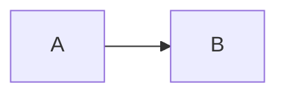

# دليل إضافة المحتوى / Content authoring guide

هذا المجلد هو **مصدر الحقيقة** لكل المحتوى التعليمي. أضِف ملفات Markdown أو MDX
هنا، وسيتولى الموقع البناء والعرض والبحث تلقائياً.

This folder is the single source truth for all educational content. Drop
Markdown/MDX files here and the platform handles rendering, navigation, search
and asset optimization automatically.

## البداية السريعة / Quick start

أنشئ ملفاً واحداً — هذا كل ما هو مطلوب:

```text
content/linux/monitoring.md
```

```yaml
---
title: المراقبة
description: مختصر يظهر في الفهرس والبحث.
category: linux
order: 3
---
```

تحفظ الملف، فيحدث التالي **تلقائياً**:

* الصفحة تظهر في القائمة الجانبية تحت فئتها
* رابطها `/docs/linux/monitoring`
* تُدرج في البحث ومسار التنقل والتنقل السابق/التالي
* تُبنى مع الموقع (`npm run build`)

لموضوع فيه صور أو ملفات، استخدم مجلداً بملف `index.mdx`:

```text
content/linux/monitoring/
├── index.mdx
├── images/
└── resources/
```

مثال حقيقي قابل للنسخ: `content/containers/docker/images/` (صفحة اختبار بنيوية
تستخدم كل الميزات أدناه).

## الملفات والمسار / Files & routes

```text
content/<category>/<topic>.md        →  /docs/<category>/<topic>
content/<category>/<topic>/index.mdx →  /docs/<category>/<topic>
content/<category>/<sub>/<topic>.md  →  /docs/<category>/<sub>/<topic>
```

الفئات المسجّلة حالياً (للاسم المعروض والترتيب فقط — أي اسم مجلد جديد يعمل
بدون تسجيل): `foundations`, `linux`, `networking`, `git`, `docker`, `ci-cd`,
`kubernetes`, `cloud`, `terraform`, `observability`, `security`,
`troubleshooting`. القائمة مرحلة وقابلة للتوسع — راجع
[`docs-roadmap.md`](../docs-roadmap.md) للخطة المرنة.

لفئة جديدة: أنشئ المجلد، ثم سجّلها في `src/data/categories.ts` (وإن لم
تسجّلها ستعمل كذلك، لكن تظهر أخيراً باسم المجلد الخام).

## اتفاقات التسمية / Naming conventions

* أسماء المجلدات والملفات: **إنجليزية صغيرة بشرطة سفلية/واصلة** (`kebab-case`) —
  `load-balancer.md`، لا مسافات ولا أسماء عربية في المسارات (الروابط تبقى كما هي).
* اسم مجلد الفئة العليا = قيمة `category` في الواجهة الأمامية.
* الملف الوحيد يكفي للموضوعات البسيطة؛ استخدم `index.mdx` عند وجود أصول
  (`images/`, `resources/`) بجانب الصفحة.
* الصور: `images/<name>.svg|png|webp` — تسمية تصف المحتوى
  (`pod-lifecycle.svg`).
* ملفات PDF المرتبطة بموضوع: `resources/<name>.pdf`.
* المسودات: عيّن `draft: true` بدلاً من حذف الملف.

## الواجهة الأمامية / Frontmatter

```yaml
---
title: عنوان الصفحة                 # مطلوب فقط مع category
description: مختصر للفهرس والبحث     # موصى به
category: kubernetes                # مطلوب — اسم مجلد الفئة
order: 1                            # الترتيب داخل الفئة (الافتراضي 0)
level: beginner                     # beginner | intermediate | advanced
tags: [kubernetes, pods]   # عضويات متعددة — أساس المسارات التعليمية المستقبلية
draft: false                        # true = لا تُبنى ولا تُفهرس
language: ar                        # ar (RTL) | en (LTR)
---
```

الحقول الإلزامية: `title` و`category` فقط — الباقي له قيم افتراضية.
الصفحات المسودة (`draft: true`) مستبعدة من التنقل والبحث وبناء الموقع.

> الصفحة لها **فئة واحدة فقط** (`category` = مكانها في القائمة الجانبية)، لكن
> أي عدد من **الوسوم** (`tags`) — المقال نفسه ينتمي لمسارات تعليمية متعددة عبر
> الوسوم دون نقل الملف. الترتيب يُضبط بـ `order:` ولا يرتبط بأسماء المجلدات.

## المكوّنات في MDX / MDX components

**لا حاجة لاستيراد المكوّنات** — وهي متاحة تلقائياً في كل صفحة `.mdx`:

```mdx
<Callout>نص ملاحظة عادي.</Callout>
<Callout type="tip" title="تلميح">نص مخصص.</Callout>
<Callout type="warning">تحذير مهم.</Callout>
<Callout type="lab">خطوات مختبر عملي.</Callout>
```

```mdx
<Steps>
  <li>الخطوة الأولى</li>
  <li>الخطوة الثانية — ويمكن أن تحتوي على فقرات أو شيفرة</li>
</Steps>
```

```mdx
<PdfCard href="/pdf/linux-cheatsheet.pdf" title="ورقة مراجع لينكس" />
<PdfEmbed src="/pdf/linux-cheatsheet.pdf" title="معاينة ورقة المراجع" />
```

أنواع `Callout`: `note` (افتراضي)، `tip`، `warning`.

> المكوّنات تعمل في ملفات **`.mdx` فقط** (لأنها JSX). ملفات `.md` العادية
> تستخدم Markdown الخالص. الاستيراد الصريح ما زال مدعوماً إن احتجت، لكنه غير
> مطلوب. الأصول (الصور/ملفات PDF) تُستورد دائماً كما هو موضح أدناه.

### Figure — صورة مع تعليق

```mdx
import placeholder from './images/placeholder.svg';

<Figure src={placeholder} alt="وصف الصورة" caption="تعليق اختياري" />
```

- ملفات `.svg` المستوردة تُعرض **مضمّنة** مباشرة (حادة بأي حجم، وتتوافق مع
  السمة اللونية).
- الصور النقطية (`png`/`webp`/…) المستوردة **تُحسَّن تلقائياً** بواسطة Astro.
- مسار عام: `<Figure src="/images/diagram.png" alt="وصف" caption="تعليق" />`.

## الصور / Images

الطريقة الأسهل — صيغة Markdown مباشرة، **بدون أي استيراد**:

```md

```

المسار النسبي يُحل تلقائياً وتُصدَّر الصورة إلى `/_astro/…` محمّلة بالكامل
ومحسّنة. استخدم `Figure` عندما تحتاج **تعليقاً (caption)** فقط.

الصور المشتركة بين موضوعات كثيرة توضع في `public/images/` وتُربط بمسار مطلق
(`/images/x.png`).

### Excalidraw

لا يوجد تنسيق مباشر لملفات `.excalidraw` — التدفق المطلوب:

1. ارسم المخطط في Excalidraw.
2. **Export → SVG** (أو PNG للصور النقطية).
3. احفظ الملف في `images/` بجانب الصفحة (اسم واضح: `architecture.svg`).
4. أدرجته كصورة Markdown أو عبر `Figure` كما بالأعلى.

## ملفات PDF / PDFs

**خيار أ — بجانب الموضوع** (مناسب لمرفق خاص بالموضوع): ضع الملف في
`resources/` واستورده:

```mdx
import cheatsheet from './resources/cheatsheet.pdf';

<PdfCard href={cheatsheet} title="اسم الملف" />
```

> الملفات الصغيرة جداً قد يضمّنها البناء مباشرة داخل الصفحة (سلوك Vite
> الافتراضي)، والأكبر تُصدَّر كملف مستقل — كلاهما يعمل مع «فتح» و«تحميل».

**خيار ب — موقع عام** (مناسب لملفات مشتركة، روابط ثابتة): ضعه في
`public/pdf/` واربطه بمسار مطلق:

```mdx
<PdfCard href="/pdf/linux-cheatsheet.pdf" title="ورقة مراجع" />
<PdfEmbed src="/pdf/linux-cheatsheet.pdf" title="معاينة مدمجة" />
```

`PdfCard` يوفّر زرّي «فتح في تبويب جديد» و«تحميل»، و`PdfEmbed` يعرض معاينة
مدمجة (بدون أي مكتبة ثقيلة — العارض الأصلي للمتصفح).

## المخططات / Mermaid

````

````

يُحمَّل مكتبة Mermaid عند الحاجة فقط (لا تُحمَّل في الصفحات بدون مخططات).

## شيفرة / Code

- أكواد الشيفرة العادية (` ```bash ` …) تعرض بـ **Shiki** مع زر نسخ تلقائي.
- كل كتلة شيفرة و`YAML` و`JSON` والأوامر و`URL` تبقى **LTR** دائماً بغض النظر
  عن اتجاه الصفحة.
- شيفرة Markdown الجاهزة (مثل جداول الأوامر) تُفهرس للبحث أيضاً.

## الاتجاه / Direction

- `language: ar` → الصفحة RTL، `language: en` → LTR.
- لا تضبط `dir` يدوياً في المحتوى العادي؛ النص العربي يعمل تلقائياً.
- استخدم الصنف `ltr` على العناصر المزدوجة نادراً (المعرفات التقنية).

## البحث / Search

كل صفحة غير مسودة تُضاف تلقائياً إلى `search-index.json` (عنوان، وصف، عناوين،
نص). البحث يدعم التطبيع العربي (الهمزات، التشكيل، التاء المربوطة).

## قبل الدفع / Before committing

```bash
npm run check   # أخطاء TypeScript
npm run build   # تأكد أن البناء ينجح
```

معاينة الصفحات: `/components-preview` تعرض كل المكوّنات المتوفرة.
