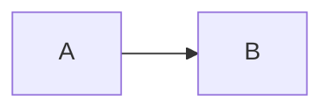

# دليل إضافة المحتوى / Content authoring guide

هذا المجلد هو **مصدر الحقيقة** لكل المحتوى التعليمي. أضِف ملفات Markdown أو MDX
هنا، وسيتولى الموقع البناء والعرض والبحث تلقائياً.

This folder is the single source of truth for all educational content. Drop
Markdown/MDX files here and the platform handles rendering, navigation, search
and asset optimization automatically.

---

## 1. هرم التوثيق / Documentation hierarchy

```text
مجال التوثيق (Area)
        ↓
التقنية / الأداة (Tool)
        ↓
الموضوع (Topic)
        ↓
المقال (Article)
```

```text
content/<area>/<tool>/<article>.md        →  /docs/<area>/<tool>/<article>
content/<area>/<tool>/<article>/index.mdx →  /docs/<area>/<tool>/<article>
content/<area>/<concept>.md               →  /docs/<area>/<concept>
```

كل مجال يحصل تلقائياً على صفحة مجال `/docs/<area>`، وكل أداة تملك مقالاً واحداً
على الأقل تأخذ صفحة أداة `/docs/<area>/<tool>`. أسماء الأدوات تبقى **إنجليزية**
في كل اللغات.

المجالات الـ 14 المعتمدة: `devops-fundamentals`, `operating-systems`,
`networking`, `version-control`, `programming-scripting`, `containers`,
`ci-cd-automation`, `container-orchestration`, `cloud-platforms`,
`infrastructure-as-code`, `configuration-management`, `observability`,
`security-devsecops`, `troubleshooting-production` — التفاصيل في
[`docs-roadmap.md`](../docs-roadmap.md).

---

## 2. إنشاء مقال جديد / Creating a new article

1. انسخ قالب المقال `content/_template/article.mdx` إلى
   `content/<area>/<tool>/<article-name>/` وأعد تسميته إلى `index.mdx`
   (أو أنشئ ملفاً مبسطاً `<article-name>.md` — انقر #3).
2. املأ `title` و`description` — فقط هذان مطلوبان.
3. اكتب المحتوى، ثم اضبط `order` و`level` و`tags` عند الحاجة.
4. `draft: false` عند النشر.
5. تحقّق: `npm run check && npm run build`.

مثال حقيقي كامل لسير العمل: `content/containers/docker/images/` — **صفحة اختبار
بنية** (لا محتوى تعليمي) تستخدم كل الميزات أدناه.

> القالب `content/_template/` مستبعد من البناء — لا يظهر في التوجيه ولا البحث.

---

## 3. MD أم MDX / Choosing MD vs MDX

| | `.md` | `.mdx` |
| --- | --- | --- |
| Markdown خالص (عناوين، جداول، قوائم، ```mermaid) | ✓ | ✓ |
| مكوّنات (`<Callout>`, `<Steps>` …) | ✗ | ✓ |
| استيراد أصول (`images/`, `resources/`) | ✗ | ✓ |

**القاعدة**: استخدم `.md` للمقالات النصية البسيطة، و`.mdx` عند الحاجة لمكوّن أو
استيراد أصل. المكوّنات مُحقونة تلقائياً في كل صفحة `.mdx` — لا استيراد لها.

---

## 4. هيكل المجلدات / Folder structure

```text
content/
└── containers/
    └── docker/
        └── images/
            ├── index.mdx          # الصفحة نفسها
            ├── images/            # أصول محلية (صور/مخططات)
            │   └── placeholder.svg
            └── resources/         # ملفات PDF محلية
                └── cheatsheet.pdf
```

* المستوى الأول = المجال = مسار URL الأول. المستوى الثاني = الأداة. الباقي =
  الموضوع.
* الأصول تبقى **محلية بالموضوع** قدر الإمكان.

---

## 5. الواجهة الأمامية / Frontmatter

```yaml
---
title: عنوان الصفحة                 # مطلوب
description: مختصر للفهرس والبحث     # موصى به بشدة
# category و tool مشتقان تلقائياً من المجلدات — لا تكررهما
order: 1                            # الترتيب داخل المجموعة (الافتراضي 0)
level: beginner                     # beginner | intermediate | advanced
tags: [containers, docker]          # وسوم متعددة
draft: false                        # true = لا يُبنى ولا يُفهرس
language: ar                        # ar (RTL) | en (LTR) — لغة المحتوى
---
```

* **المطلوب**: `title` فقط.
* `category` و `tool` **مشتقان من بنية المجلدات** (`content/<area>/<tool>/…`) —
  لا تكرر معلومات يمكن اشتقاقها. يُذكران صراحةً فقط للتجاوز/التوافق القديم.
* الصفحات المسودة مستبعدة من التنقل والبحث والبناء.

> لكل صفحة **فئة واحدة فقط** (مجالها في القائمة الجانبية) وأي عدد من
> **الوسوم** — المقال ينتمي لمسارات تعليمية متعددة عبر الوسوم دون نقل الملف.

---

## 6. الترتيب / Ordering

* `order:` يحدد الترتيب داخل نفس المجموعة (أداة أو مجال).
* **لا** تستخدم أرقاماً في أسماء المجلدات (`01-linux`) — الترتيب في البيانات
  الأمامية فقط، أسماء المجلدات تبقى مستقرة.

## 7. المستويات / Levels

`beginner ← intermediate ← advanced` — تدرّج دلالي فقط يظهر شارة في القوائم
والصفحة، **ليس** نظام كورسات: لا مراحل ولا تتبّع تقدّم ولا حسابات. إن احتاجت
المستقبلية مسارات تعلّم صريحة، تُبنى من الوسوم والبيانات الوصفية دون تغيير
بنية المحتوى (انظر «Learning paths» في docs-roadmap.md).

## 8. الوسوم / Tags

وسوم قصيرة (إنجليزية تقنية): `docker`, `kubernetes`, `networking`. تُستخدم في:

* **Related topics** — يظهر تلقائياً أسفل المقال (حتى 3 مواضيع تشارك وساماً).
* المسارات التعليمية المستقبلية.

---

## 9. الصور / Images

الأسهل — صيغة Markdown مباشرة **بدون أي استيراد**:

```md

```

المسار النسبي يُحل تلقائياً ويُصدَّر إلى `/_astro/…` محمّلاً بالكامل ومحسّناً.
استخدم `Figure` عندما تحتاج **تعليقاً (caption)** فقط (انقر #14).

## 10. SVG

* ملفات `.svg` المستوردة تُعرض **مضمّنة** مباشرة (حادة بأي حجم، وتتوافق مع
  السمة اللونية) عبر `Figure`.
* الصور النقطية (`png`/`webp`/…) المستوردة تُحسَّن تلقائياً بواسطة Astro.
* الصور المشتركة بين موضوعات كثيرة توضع في `public/images/` وتُربط بمسار
  مطلق (`/images/x.png`).

## 11. Excalidraw

لا يوجد تنسيق مباشر لملفات `.excalidraw` — التدفق المطلوب:

1. ارسم المخطط في Excalidraw.
2. **Export → SVG** (أو PNG للصور النقطية).
3. احفظه في `images/` بجانب الصفحة (اسم واضح: `architecture.svg`).
4. أدرجه كصورة Markdown أو عبر `Figure`.

## 12. ملفات PDF / PDFs

**خيار أ — بجانب الموضوع** (مناسب لموضوع بصور + PDF): ضعه في `resources/`:

```mdx
import cheatsheet from './resources/cheatsheet.pdf';

<PdfCard href={cheatsheet} title="اسم الملف" />        <!-- فتح + تحميل -->
<PdfEmbed src={cheatsheet} title="معاينة" />            <!-- معاينة مدمجة -->
```

**خيار ب — موقع عام** (روابط ثابتة/مشتركة): ضعه في `public/pdf/`:

```mdx
<PdfCard href="/pdf/linux-cheatsheet.pdf" title="ورقة مراجع" />
<PdfEmbed src="/pdf/linux-cheatsheet.pdf" title="معاينة" />
```

> ملفات PDF الصغيرة جداً قد يضمّنها البناء مباشرة (سلوك Vite)، والأكبر تُصدَّر
> كملف مستقل — كلاهما يعمل مع «فتح» و«تحميل».

---

## 13. المخططات / Mermaid

````

````

يُحمَّل مكتبة Mermaid عند الحاجة فقط (لا تُحمَّل في الصفحات بدون مخططات).

## 14. مكوّنات MDX / MDX components

**لا حاجة لاستيراد** — متاحة تلقائياً في كل صفحة `.mdx` (تُحقن عبر
`<Content components={…}>`)؛ الاستيراد الصريح مطلوب **للأصول فقط**:

```mdx
<Callout>ملاحظة عادية (note).</Callout>
<Callout type="tip" title="تلميح">نص مخصص.</Callout>
<Callout type="warning">تحذير مهم.</Callout>
<Callout type="lab">خطوة مختبر عملي.</Callout>
```

```mdx
<Steps>
  <li>الخطوة الأولى</li>
  <li>الخطوة الثانية — يمكن أن تحتوي فقرات أو شيفرة</li>
</Steps>
```

```mdx
import placeholder from './images/placeholder.svg';

<Figure src={placeholder} alt="وصف الصورة" caption="تعليق اختياري" />
```

```mdx
<PdfCard href={cheatsheet} title="ورقة مراجع" />
<PdfEmbed src="/pdf/file.pdf" title="معاينة" />
```

| المكوّن | الخصائص | الاستخدام |
| --- | --- | --- |
| `Callout` | `type` (`note\|tip\|warning\|lab`), `title?` | ملاحظة/تلميح/تحذير/مختبر |
| `Steps` | أبناء مباشرة `li` | إجراء مرقّم |
| `Figure` | `src`, `alt`, `caption?` | صورة مع تعليق |
| `PdfCard` | `href`, `title?`, `description?` | زرّا فتح/تحميل |
| `PdfEmbed` | `src`, `title`, `height?` | معاينة PDF مدمجة |

* **Related Topics** يُضاف تلقائياً أسفل كل مقال من الوسوم — لا يُكتب يدوياً.
* **في ملفات `.md` العادية**: Markdown الخالص فقط (المكوّنات JSX تعمل في MDX).

---

## 15. كتل الشيفرة / Code blocks

* حدد اللغة دائماً عند الإمكان: ` ```bash `, ` ```yaml `, ` ```dockerfile ` …
* الشيفرة و`YAML` و`JSON` والأوامر و`URL` تبقى **LTR دائماً** بغض النظر عن
  اتجاه الصفحة.
* أضِف زر نسخ تلقائي وشارة لغة تلقائياً — لا إعداد مطلوب.
* لا تضع الأوامر داخل فقرات نصية عادية.

---

## 16. اتفاقات التسمية / Naming conventions

* المجلدات والملفات: **kebab-case إنجليزي** — `dockerfile-basics`,
  `container-networking`, `pod-lifecycle`, `linux-permissions`.
* لا مسافات ولا أسماء عربية في المسارات.
* **`<topic>.md`** — مقال بسيط بلا أصول محلية.
* **`<topic>/index.mdx`** — موضوع يحتاج مجلداً مع أصول (`images/`,
  `resources/`) أو مكوّنات MDX.

---

## 17. بنية المقال / Article structure

بنية مقترحة للمقال التقني (**توصية لا قيد** — كل موضوع يختار ما يناسبه):

```text
Title + Short Description
Prerequisites        Overview              Concepts
How It Works         Important Concepts    Examples
Commands / Configuration                  Common Mistakes
Troubleshooting      Best Practices        Summary
Related Topics  (تلقائي من الوسوم)
```

أمثلة تركيز حسب النوع:

* **مفهوم/معمارية**: Concepts + How It Works (+ Mermaid).
* **مرجع أوامر**: Examples + Commands + Common Mistakes.
* **مقدمة أداة**: Prerequisites (تثبيت) + Concepts + Workflow.
* **استكشاف أخطاء**: Symptoms → Diagnosis → Solutions.

انسخ `content/_template/article.mdx` لتحصل على هذا الهيكل مع تعليقات إرشادية
ومرجع صغير لمكوّنات MDX.

---

## 18. إرشادات الكتابة التقنية / Technical writing guidelines

**الشرح أولاً** — اشرح المفهوم وسببه قبل الأمر:

```bash
docker run nginx
```

بدون شرح = سلوك سيئ. بالأفضل: ماذا يفعل الأمر ولماذا يُستخدم، ثم عرضه.

**أمثلة عملية** — أوامر واقعية قابلة للتنفيذ، وفسّر المعاملات المهمة؛ لا
تكدّس أوامر بلا شرح.

**المسائلة** — الأسماء التقنية تبقى **إنجليزية** حتى داخل مقال عربي
(`Linux`, `Docker`, `Kubernetes`, `Pod`, `Deployment`, `Service`, `Container`,
`Namespace`, `Ingress`)؛ العربية للشرح، والإنجليزية للمصطلح حتى يبقى
معترفاً به.

**الشيفرة** — لغة لكل كتلة (`bash`, `yaml` …)، والأوامر لا تعيش في فقرات.

**المخططات** — تُستخدم حين تُحسّن الفهم (Concept ↓ Architecture ↓ Flow)، لا
صور زخرفية. المخطط يشرح شيئاً.

---

## الاتجاه / Direction

- `language: ar` → منطقة المقال RTL، `language: en` → LTR. واجهة الصفحة تتبع
  لغة الواجهة المختارة (الإنجليزية افتراضياً) وليس لغة المحتوى.
- لا تضبط `dir` يدوياً في المحتوى العادي؛ النص العربي يعمل تلقائياً.
- استخدم الصنف `ltr` على العناصر المزدوجة نادراً (المعرفات التقنية).
- تعليقات `.mdx` تكتب بصيغة `{/* … */}` — تعليقات HTML خطأ في MDX.

## المخططات والجداول والمواقع

- الجداول و`<details>` وقوائم Markdown وروابط `[نص](مسار)` — كلها تعمل
  مباشرة كما في أي Markdown عادي.

## البحث / Search

كل صفحة غير مسودة تُضاف تلقائياً إلى `search-index.json` (عنوان، وصف، عناوين،
نص، وسياق «المجال · الأداة»). البحث يدعم التطبيع العربي (الهمزات، التشكيل،
التاء المربوطة).

## قبل الدفع / Before committing

```bash
npm run check   # أخطاء TypeScript
npm run build   # تأكد أن البناء ينجح
```

معاينة الصفحات: `/components-preview` تعرض كل المكوّنات المتوفرة.

## إضافة أدوات ومجالات / Adding tools & areas

- **أداة جديدة**: `content/<area>/<new-tool>/` — لا تغيير كود؛ صفحة الأداة
  تنشأ تلقائياً مع أول مقال.
- **مجال جديد**: مجلد `content/<area>/` + تسجيل في `src/data/categories.ts`
  (اسم عرض، وصف عربي/إنجليزي، أيقونة، ترتيب).
