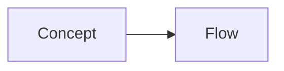

{/*
  STRUCTURAL TEMPLATE — copy the folder to content/<area>/<tool>/<article>/
  and rename it. The sections below are RECOMMENDED, not mandatory: keep what
  fits the topic and delete the rest (see "Article structure" in content/README.md).
  Keep `draft: true` while working; flip to false when publishing.
  NOTE: in .mdx files, comments must use the brace-star form shown here —
  plain HTML comments are a syntax error in MDX.
*/}

## Overview

{/* Explain what this topic is and why it matters — before showing any command. */}

## Prerequisites

{/* What the reader needs first. Delete this section when there is nothing. */}

## Concepts

{/* Core ideas and terminology. Technical names stay in English. */}

## How it works

{/* Mechanism / architecture. A diagram helps when it explains something. */}



## Examples

```bash
# Replace with a realistic, executable example and explain important flags.
echo "example"
```

## Commands / configuration

{/* Explain arguments and configuration fields next to the example. */}

## Common mistakes

<Callout type="warning">
  Placeholder — replace with one common mistake and how to avoid it.
</Callout>

## Troubleshooting

{/* Symptom → likely cause → fix. Omit when not applicable. */}

## Best practices

{/* Short, opinionated recommendations. */}

## Summary

{/* A few takeaways. Related topics appear automatically from shared tags. */}

{/*
  COMPONENT CHEATSHEET (MDX components need NO import — only assets do):

  <Callout type="note|tip|warning|lab" title="Optional custom title">Text</Callout>
  <Steps><li>Step one</li><li>Step two</li></Steps>
  <Figure src={importedImage} alt="Description" caption="Optional caption" />
  <PdfCard href={importedPdf} title="Optional title" />
  <PdfEmbed src="/pdf/file.pdf" title="Accessible viewer title" />

  Asset imports go at the top of the file:

  import diagram from './images/diagram.svg';
  import cheatsheet from './resources/cheatsheet.pdf';
*/}
