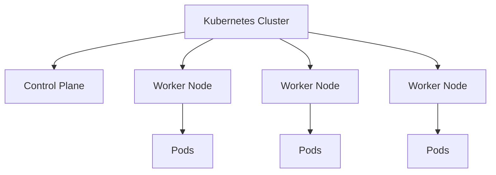
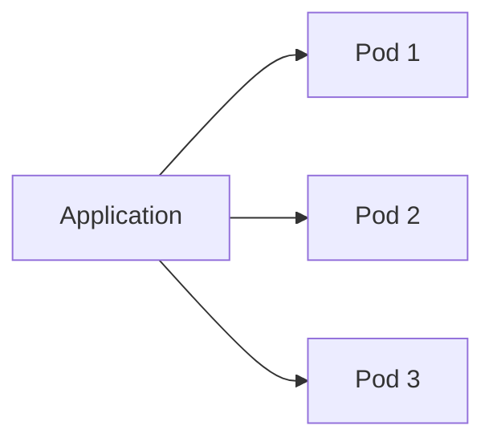
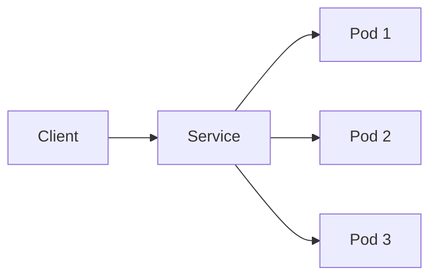
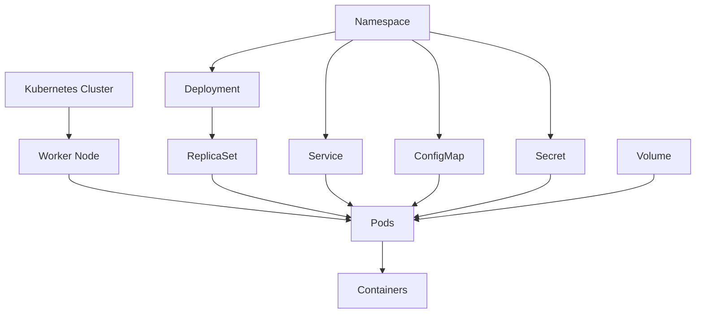
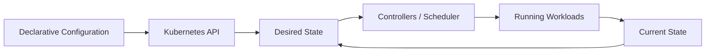
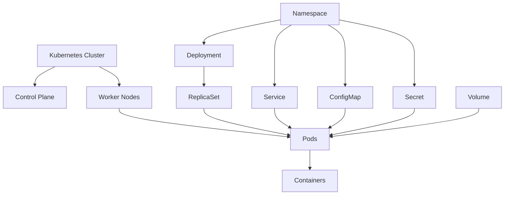

## Introduction

بعد ما فهمت **What Kubernetes is** وليه بنستخدمه، محتاج دلوقتي أفهم الـ**Core Concepts** اللي Kubernetes مبني عليها.

Kubernetes :

 عنده مجموعة من الـ**objects and abstractions** اللي بستخدمها عشان أعرّف وأدير الـcontainerized workloads.

الصورة العامة:

```text
Kubernetes Cluster
        │
        ▼
      Nodes
        │
        ▼
       Pods
        │
        ▼
   Containers
```

وحول الـPods فيه resources بتساعدني في إدارة الـapplication:

```text
                    Kubernetes
                         │
              ┌──────────┴──────────┐
              │                     │
           Workloads             Supporting
              │                     │
          Deployment             Service
              │                  ConfigMap
              ▼                    Secret
             Pods                  Volume
              │                  Namespace
              ▼
         Containers
```


---

## 1. Kubernetes Cluster

الـ**Cluster** هو البيئة الكاملة اللي Kubernetes بيدير من خلالها الـworkloads.

الـCluster بيتكون من مجموعة من الـNodes، بالإضافة إلى الـControl Plane اللي بيدير الـCluster.

بشكل مبسط:



أقدر أعتبر الـCluster هو **the whole Kubernetes environment**.

---

## 2. Node

الـ**Node** هي machine داخل الـCluster.

ممكن تكون:

* Physical machine
* Virtual machine
* Cloud instance

والـNode بتوفر الـcompute resources اللي الـworkloads هتستخدمها.

```text
Worker Node
│
├── CPU
├── Memory
├── Storage
│
└── Pods
    ├── Pod
    ├── Pod
    └── Pod
```

في Kubernetes عندنا نوعين أساسيين من الـNodes من ناحية الـrole:

```text
Control Plane Nodes
        │
        └── Manage the Cluster

Worker Nodes
        │
        └── Run Workloads
```

هنشرح الـControl Plane والـWorker Nodes بالتفصيل في **Cluster Architecture Overview**.

---

## 3. Pod

الـ**Pod** هو أصغر deployable unit في Kubernetes.

ودي نقطة مهمة جدًا:

> **Kubernetes does not deploy containers directly. It deploys Pods.**

الـPod بيحتوي على container واحد أو أكثر.

في أغلب الـapplications البسيطة، الـPod بيكون فيه container واحد:

```text
Pod
└── Container
```

لكن ممكن Pod يحتوي على multiple containers:

```text
Pod
├── Main Container
└── Sidecar Container
```

الـcontainers الموجودة داخل نفس الـPod بتشارك نفس الـnetwork context وبعض الـresources زي volumes حسب configuration.

---

## 4. Pod vs Container

لازم أفرق بينهم.

### Container

الـContainer هو package/runtime environment للتطبيق.

```text
Container
└── Application
```

### Pod

الـPod هو Kubernetes abstraction بيجمع container أو مجموعة containers مرتبطة ببعض.

```text
Pod
│
├── Container
├── Container
└── Shared Context
```

العلاقة:


فلو سألتني:

> What does Kubernetes deploy?

الإجابة الأساسية:

> **Pods.**

مش Containers directly.

---

## 5. One Pod vs Multiple Pods

لو عندي application:

```text
Pod
└── nginx
```

ده instance واحدة من الـapplication.

لو محتاج 3 instances:

```text
Pod 1
└── nginx

Pod 2
└── nginx

Pod 3
└── nginx
```

كل Pod يعتبر **independent instance** من الـworkload.



لكن عادةً أنا مش بعمل إدارة الـPods يدويًا في production.

وهنا بيظهر مفهوم مهم جدًا: **Deployment**.

---

## 6. Deployment

الـ**Deployment** هو Kubernetes resource بستخدمه لإدارة application Pods بطريقة declarative.

بدل ما أقول:

> "Create Pod 1, then Pod 2, then Pod 3."

أقول:

> **I want 3 replicas of this application.**

مثلاً:

```yaml
replicas: 3
```

والـDeployment يساعد Kubernetes في الحفاظ على العدد المطلوب من الـPods.

```text
Deployment
     │
     ▼
Desired Replicas = 3
     │
     ▼
┌────┼────┐
▼    ▼    ▼
Pod  Pod  Pod
```

---

## 7. Deployment and ReplicaSet

الـDeployment عادةً بيستخدم **ReplicaSet** لإدارة عدد الـPods.

الصورة المبسطة:

```text
Deployment
     │
     ▼
ReplicaSet
     │
     ├── Pod
     ├── Pod
     └── Pod
```

الـDeployment مسؤول عن higher-level application management، والـReplicaSet مسؤول عن maintaining the desired number of Pod replicas.

مش محتاج أدخل في تفاصيل الـReplicaSet دلوقتي؛ هنفصلها لما نوصل للـDeployments.

---

## 8. Service

الـPods بطبيعتها **ephemeral**.

يعني الـPod ممكن:

* يتعمل لها recreate
* تتغير الـIP بتاعتها
* تنتقل إلى Node مختلفة

فلو application تانية عايزة تتواصل مع Pod معينة، الاعتماد على الـPod IP مباشرة مش practical.

هنا بيظهر الـ**Service**.

الـService بيوفر:

> **A stable network endpoint for accessing a group of Pods.**

بشكل مبسط:

```text
              Service
                 │
        ┌────────┼────────┐
        ▼        ▼        ▼
      Pod 1    Pod 2    Pod 3
```

بدل ما الـclient يعرف الـIP بتاع كل Pod، يتعامل مع الـService.



الـService كمان بيساعد في **service discovery** وtraffic distribution بين الـPods حسب نوع الـService والـconfiguration.

---

## 9. Deployment + Service

دول من أهم الـconcepts اللي هستخدمهم مع بعض.

مثلاً عندي:

```text
                 Service
                    │
          ┌─────────┼─────────┐
          ▼         ▼         ▼
        Pod 1     Pod 2     Pod 3
          │         │         │
       App #1    App #2    App #3
```

والـDeployment هو اللي بيدير الـPods:

```text
             Deployment
                  │
                  ▼
             ReplicaSet
                  │
        ┌─────────┼─────────┐
        ▼         ▼         ▼
      Pod 1     Pod 2     Pod 3
        ▲         ▲         ▲
        └─────────┼─────────┘
                  │
               Service
```

فبشكل مبسط:

> **Deployment manages the Pods.**
> **Service provides stable access to the Pods.**

---

## 10. Labels

الـ**Labels** عبارة عن key-value pairs بستخدمها عشان أعرّف وأصنّف الـKubernetes objects.

مثلاً:

```yaml
labels:
  app: nginx
  environment: production
```

الـLabel هنا بيقول:

```text
app = nginx
environment = production
```

الـLabels مهمة جدًا لأنها بتخليني أقدر أعمل:

* Grouping
* Selection
* Organization
* Resource association

مثلاً الـService ممكن تستخدم label selector عشان تعرف الـPods اللي المفروض تبعتلها traffic.

```text
Service
   │
   │ selector: app=nginx
   ▼
┌───────────────┐
│ Pod 1         │ app=nginx
│ Pod 2         │ app=nginx
│ Pod 3         │ app=redis
└───────────────┘

Service → Pod 1, Pod 2
```

وده concept مهم جدًا لأن الـServices والـDeployments والـcontrollers بيعتمدوا على labels في حالات كتير.

---

## 11. ConfigMap

مش كل configuration لازم تتحط جوه الـcontainer image.

مثلاً application محتاجة:

```text
APP_ENV=production
LOG_LEVEL=info
API_URL=...
```

ممكن أخزن الـnon-sensitive configuration في **ConfigMap**.

```text
ConfigMap
│
├── APP_ENV=production
├── LOG_LEVEL=info
└── API_URL=...
        │
        ▼
      Pod
```

الفكرة الأساسية:

> **ConfigMap stores non-confidential configuration data separately from the application image.**

وده بيساعدني أفصل:

```text
Application
     +
Configuration
```

بدل ما أعمل container image مختلفة لكل environment.

---

## 12. Secret

الـ**Secret** بيستخدم لتخزين sensitive data زي:

* Passwords
* API keys
* Tokens
* Credentials

مثلاً:

```text
Secret
│
├── DB_USERNAME
├── DB_PASSWORD
└── API_TOKEN
       │
       ▼
      Pod
```

الفكرة:

> **Secret is designed for sensitive configuration data.**

لكن مهم جدًا أفهم إن وجود البيانات في Kubernetes Secret **مش معناه تلقائيًا إنها encrypted everywhere** أو إن Secret management أصبح آمنًا بالكامل. طريقة التخزين والـencryption-at-rest والـaccess control مهمة جدًا.

هنفصل الـSecrets في جزء الـSecurity.

---

## 13. ConfigMap vs Secret

الفرق الأساسي:

| Resource      | Purpose                     |
| ------------- | --------------------------- |
| **ConfigMap** | Non-sensitive configuration |
| **Secret**    | Sensitive configuration     |

مثال:

```text
ConfigMap
APP_ENV=production
LOG_LEVEL=info
```

بينما:

```text
Secret
DB_PASSWORD=********
API_TOKEN=********
```

---

## 14. Volume

الـcontainers بطبيعتها ممكن تكون **ephemeral**.

يعني البيانات اللي جوه container filesystem مش لازم تفضل موجودة بنفس الطريقة لو الـcontainer اتشال واتعمل غيره.

لو عندي application محتاجة persistent data، ممكن أستخدم **Volumes**.

```text
Pod
│
├── Container
│
└── Volume
       │
       ▼
 Persistent Storage
```

مثلاً:

```text
Database Pod
     │
     ▼
   Volume
     │
     ▼
 Persistent Data
```

الـVolume بيفصل الـstorage عن lifecycle بتاع الـcontainer حسب نوع الـvolume.

هنفصل أنواع الـVolumes والـPersistent Volumes لاحقًا.

---

## 15. Namespace

الـ**Namespace** بستخدمه عشان أقسم الـresources داخل نفس الـCluster إلى logical groups.

مثلاً:

```text
Kubernetes Cluster
│
├── production
│   ├── Pods
│   ├── Services
│   └── Deployments
│
├── staging
│   ├── Pods
│   ├── Services
│   └── Deployments
│
└── development
    ├── Pods
    ├── Services
    └── Deployments
```

ده بيساعد في:

* Organization
* Isolation boundaries
* Resource management
* Access control

لكن الـNamespace مش معناه إن resources اتحطت على machines منفصلة.

> **Namespace is a logical boundary inside a cluster, not a physical cluster.**

---

## 16. The Core Relationship

دلوقتي نقدر نجمع أهم الـconcepts:



الـdiagram ده مش بيمثل كل العلاقات الممكنة في Kubernetes، لكنه بيديني **high-level mental model**.

---

## 17. A Typical Kubernetes Application

ممكن application بسيطة في Kubernetes تبقى بالشكل ده:

```text
                    Namespace
                        │
              ┌─────────┴─────────┐
              │                   │
          Deployment           Service
              │                   │
          ReplicaSet              │
              │                   │
       ┌──────┼──────┐            │
       ▼      ▼      ▼            │
      Pod    Pod    Pod ◄─────────┘
       │      │      │
    Container Container Container
       │
       ├── ConfigMap
       ├── Secret
       └── Volume
```

دي صورة قريبة  من الـpattern اللي هتقابله في applications حقيقية.

---

## 18. Declarative Model

كل الـconcepts دي بتشتغل بشكل كبير مع الـ**declarative model** بتاع Kubernetes.

أنا بدل ما أقول:

```text
Create Pod
Start Container
Restart if it fails
Keep 3 copies
Expose them
```

بحدد الـdesired configuration:

```yaml
replicas: 3
```

وأحدد resources زي:

```text
Deployment
Service
ConfigMap
Secret
```

وبعدين Kubernetes components تتعامل مع الحالة المطلوبة.



---

## 19. The Most Important Mental Model

لو لسه جديد في Kubernetes، أهم hierarchy أفتكرها هي:

```text
Cluster
   │
   └── Nodes
         │
         └── Pods
               │
               └── Containers
```

وبعدين أضيف الـmanagement layer:

```text
Deployment
    │
    ▼
ReplicaSet
    │
    ▼
Pods
    │
    ▼
Containers
```

والـnetworking layer:

```text
Service
   │
   ▼
Pods
```

والـconfiguration/storage:

```text
ConfigMap ──┐
Secret ─────┼──► Pod
Volume ─────┘
```

والـorganization:

```text
Namespace
    │
    ├── Deployments
    ├── Services
    ├── Pods
    ├── ConfigMaps
    └── Secrets
```

---

## 20. Quick Reference

| Concept        | What it does                                             |
| -------------- | -------------------------------------------------------- |
| **Cluster**    | The complete Kubernetes environment                      |
| **Node**       | Machine that provides compute resources                  |
| **Pod**        | Smallest deployable unit in Kubernetes                   |
| **Container**  | Runs the application process                             |
| **Deployment** | Manages application Pods declaratively                   |
| **ReplicaSet** | Maintains the desired number of Pod replicas             |
| **Service**    | Provides stable network access to Pods                   |
| **Label**      | Identifies and groups Kubernetes objects                 |
| **ConfigMap**  | Stores non-sensitive configuration                       |
| **Secret**     | Stores sensitive configuration data                      |
| **Volume**     | Provides storage to workloads                            |
| **Namespace**  | Provides logical organization/isolation inside a cluster |

---

## 21. Core Concepts in One Diagram



---

## Final Summary

ان Kubernetes عنده مجموعة من الـ**Core Concepts**، وكل concept له responsibility واضحة.

أهم hierarchy لازم تكون ثابتة عندي:

> **Cluster → Node → Pod → Container**

وأهم management relationship:

> **Deployment → ReplicaSet → Pods**

وأهم networking relationship:

> **Service → Pods**

ومع الـconfiguration والـstorage:

> **ConfigMap / Secret / Volume → Pod**

وأقدر أنظم الـresources داخل:

> **Namespace**

الصورة الكاملة:

```text
                    Kubernetes Cluster
                           │
                     ┌─────┴─────┐
                     │           │
                Control Plane   Nodes
                                 │
                                 ▼
                                Pods
                                 │
                                 ▼
                             Containers

               ┌────────────────────────────────┐
               │ Management & Supporting Layer  │
               │                                │
               │ Deployment → ReplicaSet → Pods │
               │ Service ────────────────→ Pods │
               │ ConfigMap ──────────────→ Pods │
               │ Secret ─────────────────→ Pods │
               │ Volume ─────────────────→ Pods │
               │ Namespace → organizes resources│
               └────────────────────────────────┘
```

**الفكرة الأساسية:**

اننا مش بنتعامل مع Kubernetes كـمجموعة commands منفصلة. الهدف اننا نبنى **mental model** للعلاقة بين الـresources، وبعد كده كل concept هننزله في التفاصيل والـYAML والـ`kubectl` commands لما نوصل له قدام ان شاء الله.
