## Introduction

في الجزء اللى فات  فهمنا:
- اى هو الـ Pod.
- ازاى نقوم بإنشائه.
- ازاى نضيف Configuration.
- ازاى نحدد Resources.

لكن في بيئة الـ Production، السؤال الأهم:

اى اللى هيحصل لو التطبيق فشل؟

مثلاً:

- الـ Container توقف.
- الـ Application أصبح غير مستجيب.
- الـ Pod يعمل لكن التطبيق بداخله مش شغال 
- الـ Pod لا يستطيع أن يبدأ.

هنا يأتي دور:

- Pod Lifecycle
- Container States
- Restart Policy
- Health Probes
- Troubleshooting

---

## 1.Pod Lifecycle

### I. What is Pod Lifecycle?

الـ **Pod Lifecycle** هو دورة حياة الـ Pod من لحظة إنشائه حتى انتهائه.

يمر الـ Pod بعدة مراحل (Phases) تحدد حالته الحالية.

---

## 2.Pod Lifecycle Flow

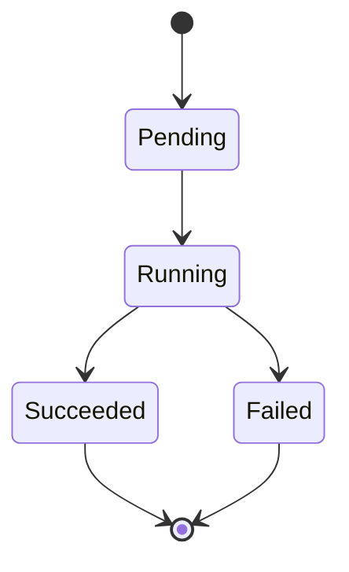

---

## 3.Pod Phases

### I. Pending

#### I.What does Pending mean?

يعني أن Kubernetes قام بإنشاء الـ Pod object، لكن الـ Pod لم يبدأ التشغيل بعد.

الـ Pod قد يكون في حالة Pending بسبب:

- Waiting for Scheduling.
- Pulling Container Image.
- Not enough resources.

---

Example:

```bash
kubectl get pods
```

Output:

```text
NAME        STATUS

nginx-pod   Pending
```

---

#### II. Check Pending Reason

نستخدم:

```bash
kubectl describe pod nginx-pod
```

ونبحث عن:

```text
Events:
```

مثال:

```text
FailedScheduling

0/1 nodes available:
Insufficient cpu
```

---

### II. Running

#### I. What is Running?

يعني:

- تم اختيار Node.
- تم تشغيل Container.
- التطبيق يعمل.

Example:

```text
NAME        READY   STATUS

nginx-pod   1/1     Running
```

---

### III. Succeeded

تحدث عندما ينتهي الـ Container بنجاح.

غالبًا مع:

- Jobs
- Batch workloads

Example:

```text
STATUS

Completed
```

---

### III. Failed

يعني أن الـ Container انتهى بسبب Error.

مثال:

```text
STATUS

Failed
```

أسباب:

- Application crash.
- Wrong configuration.
- Missing files.

---

## 4.Container States

الـ Pod يحتوي على Containers.

وكل Container له Lifecycle خاص به.

Kubernetes يراقب حالة كل Container.

---

## 5.Container States Types

يوجد ثلاث حالات رئيسية:

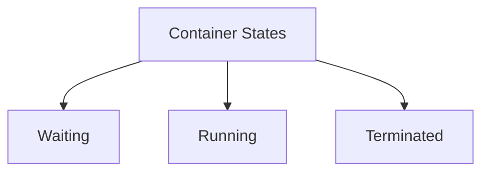

---

### I. Waiting State

#### I. What is Waiting?

يعني أن الـ Container لم يبدأ التشغيل بعد.

لكن Kubernetes ينتظر حدوث شيء.

أمثلة:

- Pull Image.
- Waiting for dependencies.
- Configuration issue.

---

Example:

```bash
kubectl describe pod nginx-pod
```

Output:

```text
State:

Waiting

Reason:

ImagePullBackOff
```

---

### II. Running State

يعني:

الـ Container يعمل حاليًا.

مثال:

```text
State:

Running
```

---

### III. Terminated State

يعني:

الـ Container انتهى.

يمكن أن يكون:

نجاح:

```text
Exit Code: 0
```

أو Error:

```text
Exit Code: 1
```

---

## 6.Container State Flow

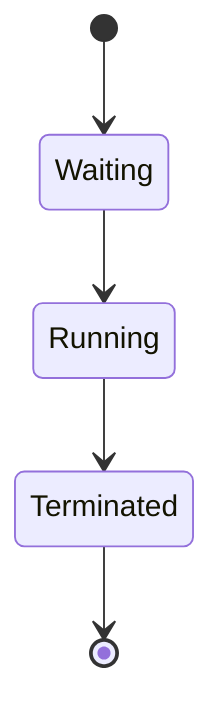

---

## 7.Restart Policy

### I. What is restartPolicy?

عندما يتوقف الـ Container، Kubernetes يحتاج يعرف:

هل يعيد تشغيله أم لا؟

هذا يتم تحديده باستخدام:

```yaml
restartPolicy
```

---

## 8.Available Restart Policies

Kubernetes يوفر ثلاث اختيارات:

| Policy | Description |
|---|---|
| Always | Always restart container |
| OnFailure | Restart only if container fails |
| Never | Never restart container |

---

### I.Always

```yaml
restartPolicy: Always
```

السلوك:

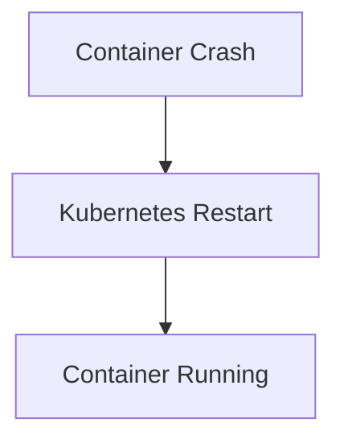

هذا هو الـ Default في Pods التي تدير Applications.

---

### II. OnFailure

```yaml
restartPolicy: OnFailure
```

يعيد التشغيل فقط إذا حدث Error.

مثال:

```text
Exit Code 1

Restart

Exit Code 0

No Restart
```

---

### III. Never

```yaml
restartPolicy: Never
```

إذا توقف الـ Container:

لا يتم إعادة تشغيله.

يستخدم غالبًا مع:

- Jobs
- One-time tasks

---

## 9.Restart Policy Flow

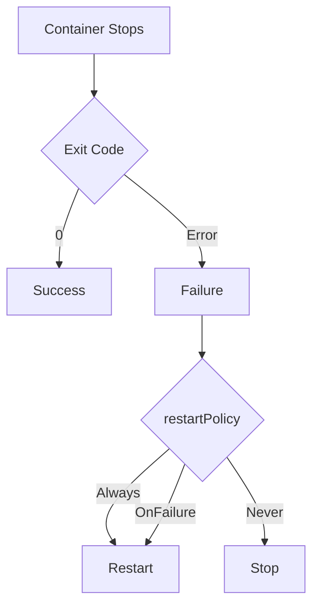

---

## 10.Health Checks (Probes)

### I. Why do we need Probes?

قد يكون الـ Container يعمل، لكن التطبيق داخله لا يعمل.

مثال:

```text
Container Status:

Running


Application:

Not responding
```

Kubernetes يحتاج طريقة يعرف بها حالة التطبيق.

وهنا تأتي:

**Probes**

---

## 11.Types of Probes

 عندنا Kubernetes عنده ثلاث أنواع:

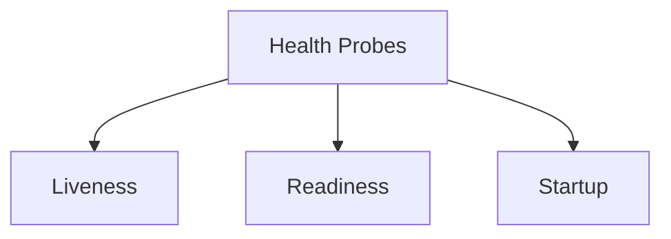

---

## 12.Liveness Probe

### I. What is Liveness Probe?

تخبر Kubernetes:

> هل التطبيق ما زال حيًا؟

إذا فشل الـ Probe:

Kubernetes يقوم بعمل Restart للـ Container.

---

Example:

```yaml
livenessProbe:

  httpGet:

    path: /

    port: 80

  initialDelaySeconds: 10

  periodSeconds: 5
```

---

## 13.Liveness Flow

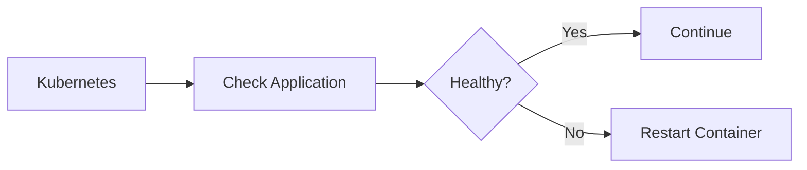

---

## 14.Readiness Probe

### I.What is Readiness Probe?

تخبر Kubernetes:

> هل التطبيق جاهز لاستقبال Traffic؟

الفرق:

Liveness:
هل التطبيق حي؟

Readiness:
هل التطبيق جاهز؟

---

Example:

```yaml
readinessProbe:

  httpGet:

    path: /

    port: 8080
```

---

## 15.Readiness Flow

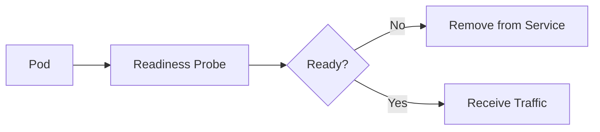

---

## 16.Startup Probe

### I. What is Startup Probe?

تستخدم للتطبيقات التي تحتاج وقت طويل لكي تبدأ.

مثال:

- Large Java Applications.
- Legacy Applications.

بدون Startup Probe:

قد يقوم Liveness Probe بعمل Restart قبل أن يبدأ التطبيق.

---

Example:

```yaml
startupProbe:

  httpGet:

    path: /

    port: 8080

  failureThreshold: 30

  periodSeconds: 10
```

---

## 17.Probe Relationship

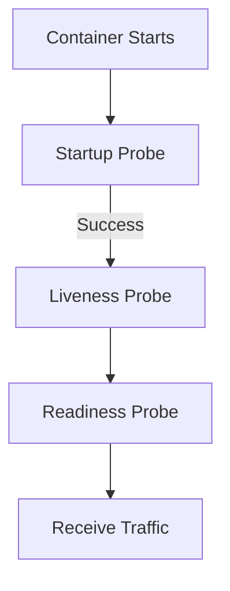

---

## 18.Practical Troubleshooting Scenarios

الآن هنطبق طريقة التفكير عند حدوث مشكلة.

---

### I. Scenario 1: Pod Stuck in Pending

#### I. Problem

```bash
kubectl get pods
```

Output:

```text
nginx-pod Pending
```

---

#### II. Investigation

Step 1:

```bash
kubectl describe pod nginx-pod
```

نبحث عن Events.

Example:

```text
FailedScheduling

Insufficient cpu
```

---

#### III. Solution

نراجع:

- Node resources.
- CPU requests.
- Memory requests.

---

### II. Scenario 2: ImagePullBackOff

#### I. Problem

```text
STATUS:

ImagePullBackOff
```

---

#### II. Cause

Kubernetes لا يستطيع تحميل الـ Image.

أسباب:

- Wrong image name.
- Private registry authentication.
- Network issue.

---

#### III. Debug

```bash
kubectl describe pod pod-name
```

---

### III. Scenario 3: CrashLoopBackOff

#### I.Problem

Pod يعيد التشغيل باستمرار.

```text
STATUS:

CrashLoopBackOff
```

---

#### II.Flow

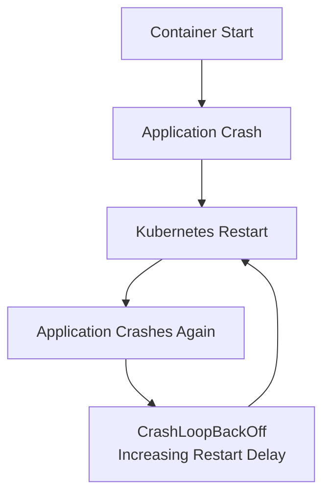

---

#### II.Debug

View logs:

```bash
kubectl logs pod-name
```

Previous crash:

```bash
kubectl logs pod-name --previous
```

---

### IV. Scenario 4: Pod Running But Application Not Working

#### I.Problem

```text
Pod:

Running


Application:

Not Available
```

---

#### II.Check

1. Readiness:

```bash
kubectl describe pod pod-name
```

2. Logs:

```bash
kubectl logs pod-name
```

3. Execute inside:

```bash
kubectl exec -it pod-name -- bash
```

---

## 19.Complete Troubleshooting Workflow

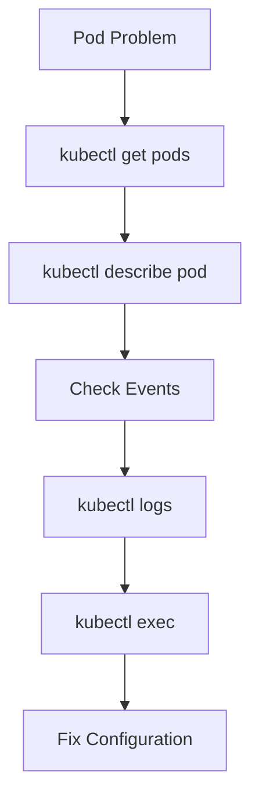

---

## 20.Useful Debug Commands

### I. Get Pods

```bash
kubectl get pods
```

---

### II. Detailed Information

```bash
kubectl describe pod pod-name
```

---

### III. Logs

```bash
kubectl logs pod-name
```

---

### IV. Previous Container Logs

```bash
kubectl logs pod-name --previous
```

---

### V. Execute Command

```bash
kubectl exec -it pod-name -- bash
```

---
