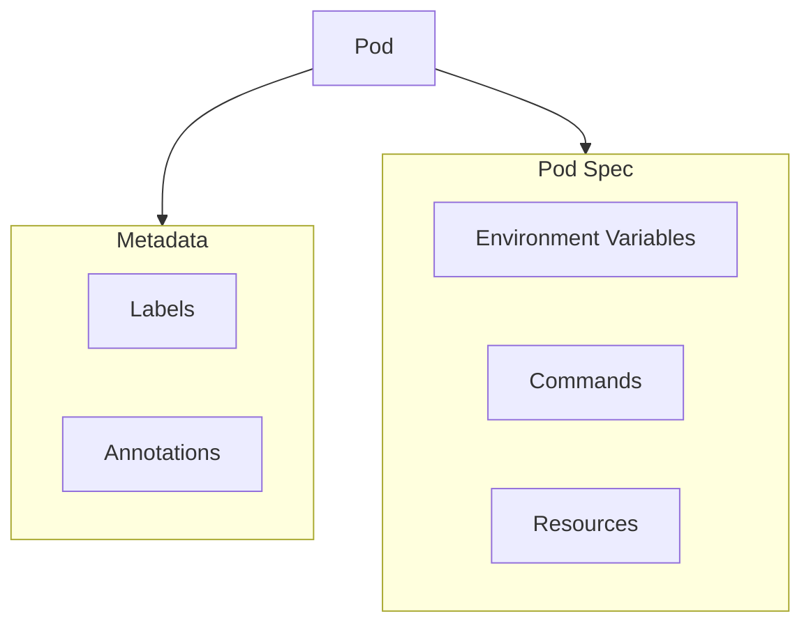
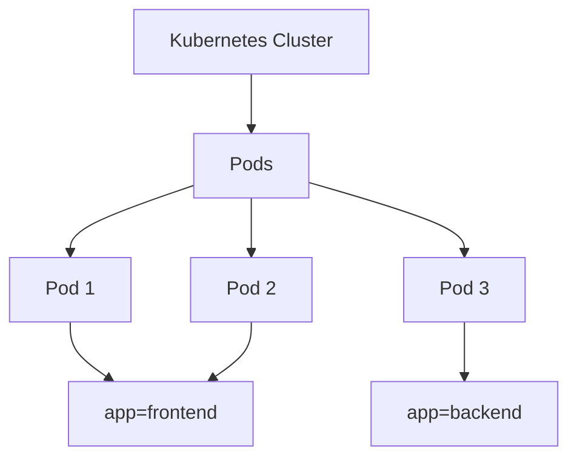
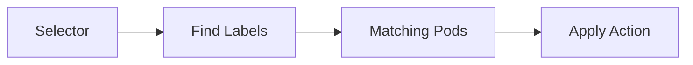
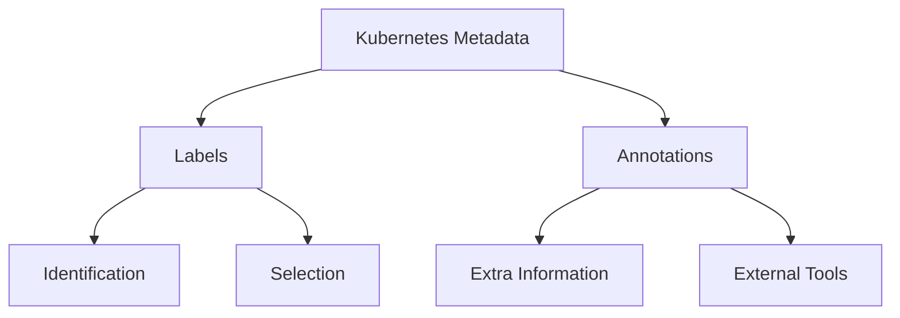
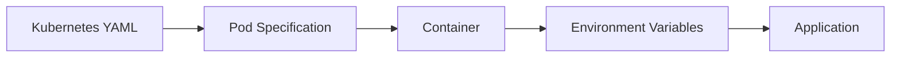

## 1.Pod Configuration and Management

في الجزء اللى فات  فهمنا:

- اى هو الـ Pod.
-بيشتغل ازاى 
-ازاى نعمل Pod بسيط

لكن الـ Pods في الواقع محتاجه لمعلومات إضافية عشان بتم إدارتها داخل Kubernetes.

مثل:

- ازاى نعرف هذا الـ Pod؟
- ازاى نربطه بـ Service؟
- ازاى نضيف Configuration؟
- ازاى نحدد الموارد التي يحتاجها؟
- ازاى نشخص المشاكل؟

وهنا تأتي مفاهيم:



---

## 2.Labels

### I.What are Labels?

الـ **Labels** هي Key-Value pairs يتم إضافتها إلى Kubernetes Resources بهدف تصنيفها وتنظيمها.

بمعنى :

Labels تعمل كـ Tags تساعد Kubernetes والمستخدمين في تحديد الـ Resources.

مثال:

```yaml
labels:
  app: nginx
  environment: production
```

---

### II.Why Do We Need Labels?

لأن Kubernetes يحتوي على عدد كبير من الـ Resources.

مثلاً:

```text
Kubernetes Cluster

Pods:

nginx-1
nginx-2
api-1
database-1
worker-1
```

بدون Labels سيكون من الصعب معرفة أي Pods تنتمي لأي Application.

---

### III.Labels Example

بدل:

```text
Pods

pod-1
pod-2
pod-3
```

نستخدم:

```text
Pods

pod-1
 app=frontend

pod-2
 app=frontend

pod-3
 app=backend
```

---

### IV.Label Architecture



---

## 3.Adding Labels to a Pod

Example:

```yaml
apiVersion: v1

kind: Pod

metadata:
  name: nginx-pod
  labels:
    app: nginx
    environment: dev

spec:
  containers:
    - name: nginx
      image: nginx
```

---

## 4.Viewing Labels

عرض الـ Labels:

```bash
kubectl get pods --show-labels
```

Output:

```text
NAME        STATUS     LABELS

nginx-pod   Running    app=nginx,environment=dev
```

---

## 5.Filtering Using Labels

يمكننا البحث باستخدام Label:

```bash
kubectl get pods -l app=nginx
```

الـ `-l` تعني:

```text
--selector
```

---

## 6.Labels and Selectors

ال Labels لوحدها مش بتعمل حاجه 

القوة الحقيقية لما نستخدم:

**Selectors**

الـ Selector يبحث عن Resources لها Labels معينة.

---

## 7.Selector Flow



---

مثال:

Service يبحث عن Pods:

```yaml
selector:
  app: nginx
```

Kubernetes يقول:

"هات كل الـ Pods التي لديها label app=nginx"

---

## 8.Annotations

### I.What are Annotations?

الـ **Annotations** تشبه الـ Labels لكنها تستخدم لتخزين معلومات إضافية عن الـ Resource.

الفرق الأساسي:

| Labels | Annotations |
|-|-|
| Used for identification and selection | Used for metadata |
| Can be used by Kubernetes selectors | Not used for selection |
| Usually short values | Can contain large information |

---

### II.Example

```yaml
metadata:

  annotations:
    description: "Nginx frontend server"
    owner: "devops-team"
```

---

### III.Why Use Annotations?

تستخدم عادة في:

- Documentation.
- External tools.
- Monitoring systems.
- CI/CD information.

مثال:

```text
Pod

Labels:
app=nginx

Annotations:

created-by=github-actions
version=1.0
```

---

## 9.Labels vs Annotations



---

## 10.Environment Variables

### I.What are Environment Variables?

الـ Environment Variables تستخدم لإرسال Configuration values إلى الـ Container.

بدل كتابة القيم داخل التطبيق، نقوم بتمريرها أثناء تشغيل الـ Container.

---

مثال:

Application يحتاج Database URL:

بدل:

```text
database.example.com
```

داخل الكود.

نستخدم:

```text
DATABASE_URL
```

---

## 11.Environment Variable Example

```yaml
apiVersion: v1

kind: Pod

metadata:
  name: app-pod


spec:

  containers:

  - name: app

    image: my-app

    env:

    - name: APP_ENV
      value: production

    - name: APP_VERSION
      value: "1.0"
```

---

## 12.Environment Flow



---

## 13.Check Environment Variables

الدخول داخل Container:

```bash
kubectl exec -it pod-name -- bash
```

ثم:

```bash
env
```