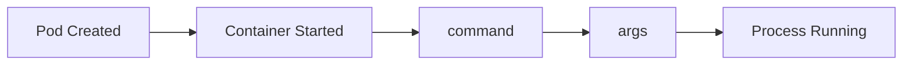
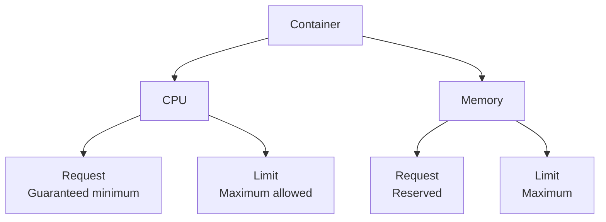
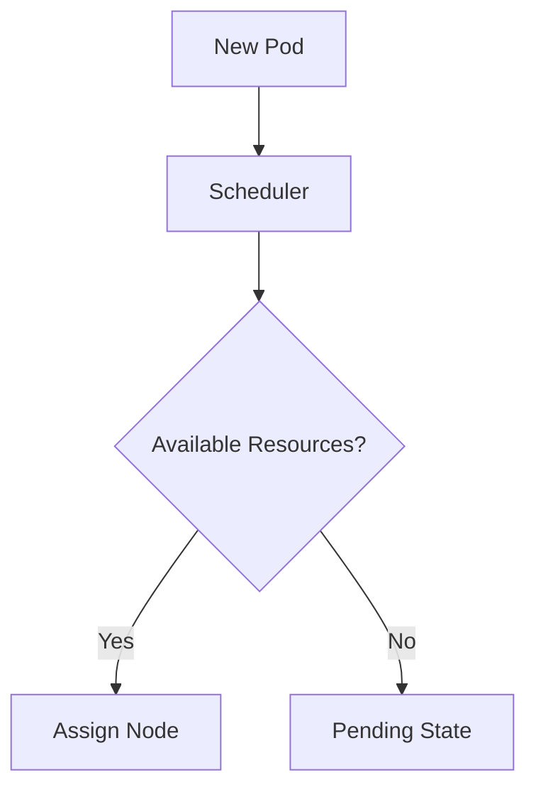
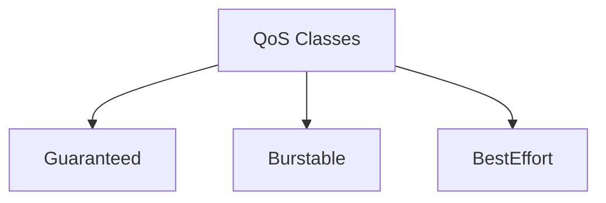

## 1.Commands and Arguments

### I.Container Startup

عند تشغيل Container، Docker يستخدم:

- ENTRYPOINT
- CMD

ف Kubernetes يوفر نفس الفكرة عن طريق:

- command
- args

---

## 2.command

يقوم بتغيير الـ main process الذي يتم تشغيله.

Example:

```yaml
command:
  - sleep
```

---

## 3.args

القيم التي ببعتها للـ command.

Example:

```yaml
args:
  - "3600"
```

---

## 4.Command Example

```yaml
apiVersion: v1

kind: Pod

metadata:
  name: command-demo


spec:

  containers:

  - name: ubuntu

    image: ubuntu

    command:
      - sleep

    args:
      - "3600"
```

---

## 5.Command Flow



---

## 6.Resource Management

في Kubernetes، كل Container يحتاج موارد عشان يشتغل.

الموارد الأساسية:

- CPU
- Memory

ف Kubernetes يسمح لنا بتحديد:

- Requests
- Limits

---

## 7.Resource Requests

### I.What are Requests?

الـ Request هو أقل كمية موارد يحتاجها الـ Container لكي يتم تشغيله.

مثال:

```yaml
resources:

 requests:

   cpu: "100m"

   memory: "128Mi"
```

يعني:

"أنا أحتاج 100 millicores CPU و 128 MB Memory"

---

## 8.Resource Limits

### I.What are Limits?

الـ Limit هو الحد الأقصى للموارد التي يسمح للـ Container باستخدامها.

مثال:

```yaml
resources:

 limits:

   cpu: "500m"

   memory: "256Mi"
```

---

## 9.Requests vs Limits



---

## 10.Resource Scheduling Flow



---

## 11.Complete Resource Example

```yaml
apiVersion: v1

kind: Pod

metadata:

  name: resource-demo


spec:

  containers:

  - name: nginx

    image: nginx


    resources:

      requests:

        memory: "128Mi"

        cpu: "100m"


      limits:

        memory: "256Mi"

        cpu: "500m"
```

---

## 12.Quality of Service Classes

عندنا Kubernetes يعطي كل Pod QoS Class بناءً على Resource Configuration.

الأنواع:



---

## 13.Guaranteed

يحدث عندما:

Request == Limit

Example:

```yaml
requests:
 cpu: 1

limits:
 cpu: 1
```

---

## 14.Burstable

عندما يوجد Requests و Limits لكن ليست متساوية.

Example:

```yaml
requests:
 cpu: 100m

limits:
 cpu: 500m
```

---

## 15.BestEffort

بدون Requests أو Limits.

---

