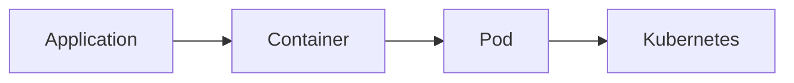
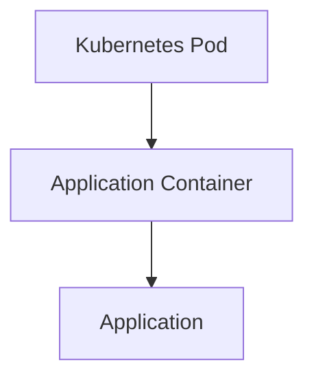
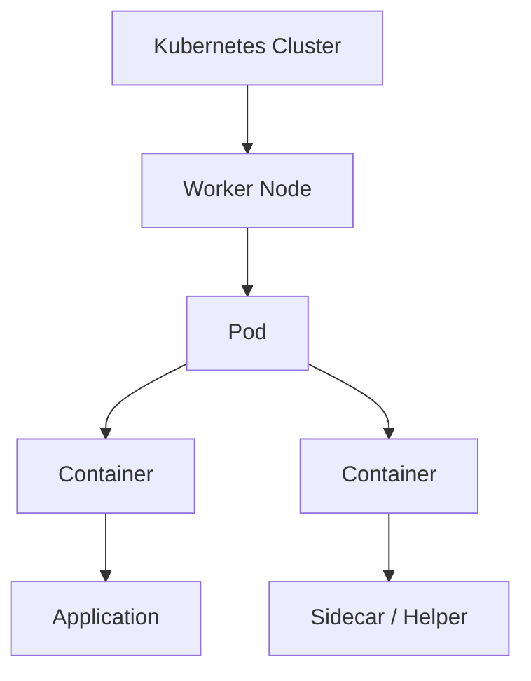
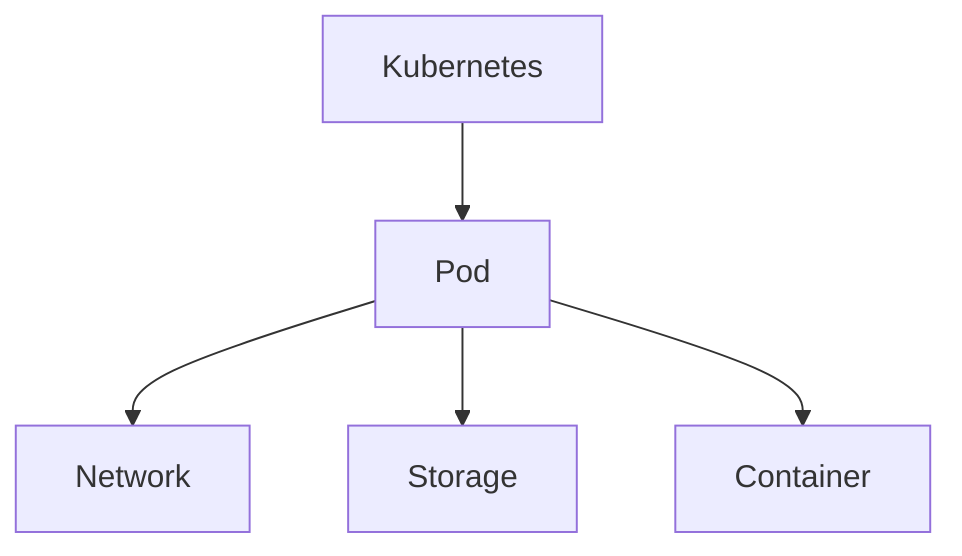
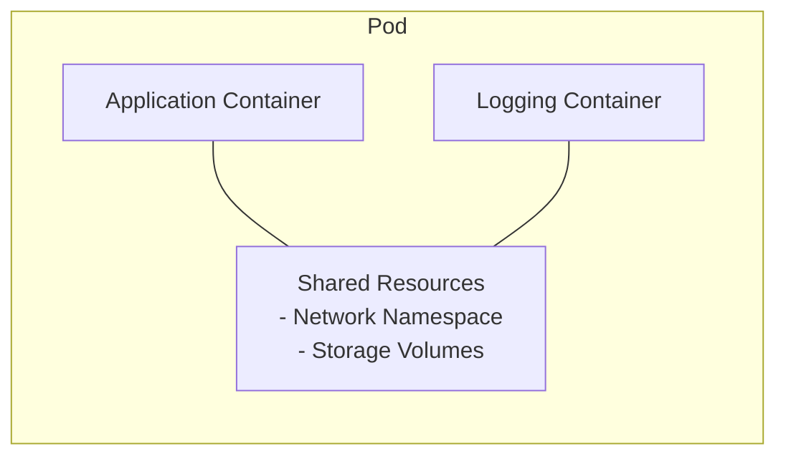
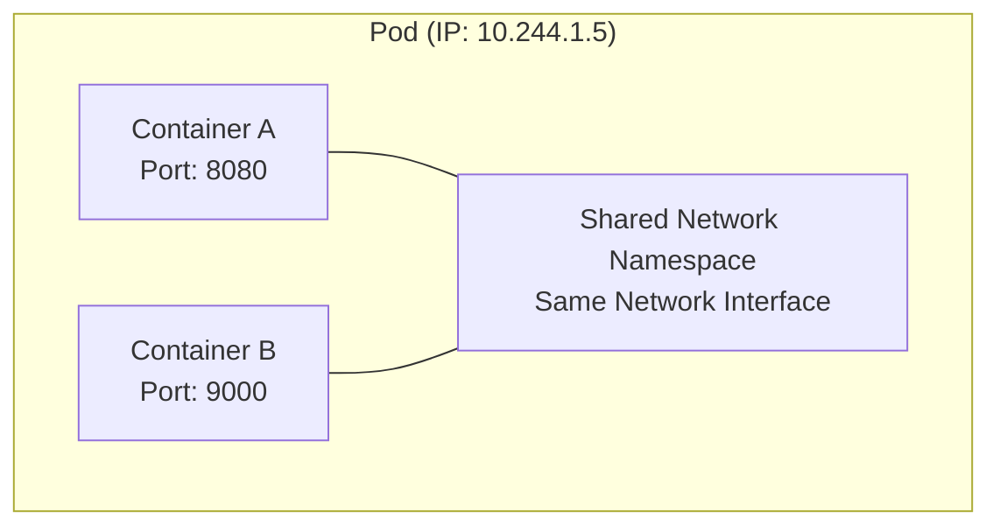
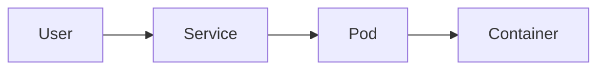
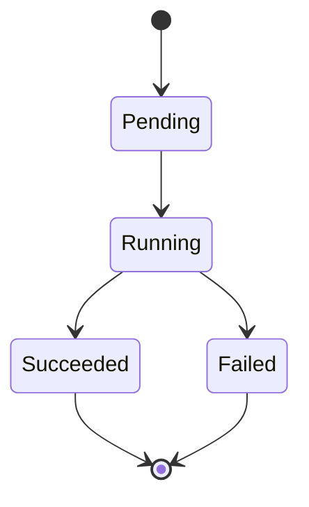

## Introduction

لما نيجي نتكلم عن Kubernetes لازم نفهم أول concept وهو الـ **Pod**.

الـ Pod يعتبر أصغر وحدة (smallest deployable unit) في Kubernetes.

يعني Kubernetes مش بيتعامل مع الـ containers بشكل مباشر،
هو بيعمل management للـ containers عن طريق الـ Pods.

بمعنى أبسط:

- الـ Container هو اللي بيشغل الـ application.
- الـ Pod هو الـ wrapper أو الـ layer اللي Kubernetes بيعمله manage.

الـ relationship بينهم:


---

## 1.What is a Pod?
الـ Pod هو عبارة عن مجموعة من واحد أو أكثر من الـ containers
اللي بيشتغلوا مع بعض كـ وحدة واحدة.
في أغلب الحالات الـ Pod بيكون فيه container واحد فقط.

مثال:


هنا عندنا:
- Pod اسمه nginx-pod
- جواه container واحد اسمه nginx
- الـ container بيشغل nginx application
---

## 2.Pod Architecture

داخل Kubernetes:


---

## 3.Why Does Kubernetes Use Pods?
ممكن نسأل:
ليه Kubernetes محتاج Pod؟ ليه ما يشغلش الـ container مباشرة؟

الإجابة إن Kubernetes محتاج abstraction layer يدير من خلالها الـ containers.
الـ Pod بيوفر:
- Networking
- Storage sharing
- Container grouping
- Lifecycle management
يعني Kubernetes يتعامل مع الـ Pod كـ object واحد.


---

## 4.Pod vs Container
مهم جداً نفرق بين الاثنين.
Container	Pod
Docker concept	Kubernetes concept
يشغل application	يدير container أو أكثر
يحتوي image	يحتوي container definition
مستقل عن Kubernetes	Managed by Kubernetes

الفرق:

| Container | Pod |
|---|---|
| Runs the application | Kubernetes management unit |
| Managed by Container Runtime | Managed by Kubernetes |
| One process environment | Can contain one or more containers |
| Has its own filesystem | Containers share Pod resources |

---

## 5.Pod with Multiple Containers

الـ Pod يمكن أن يحتوي على أكثر من Container.

مثال:

Application Container + Logging Sidecar


---

## 6.Pod Networking

واحدة من أهم أفكار الـ Pod:

كل Containers داخل نفس الـ Pod تشترك في:

- Same Network Namespace.
- Same IP Address.
- Same Port Space.

---

### I.Networking Example



---

### II.Pod Network Flow


---

## 7.Creating First Pod

Kubernetes resources يتم تعريفها باستخدام YAML files.

مثال:

`nginx-pod.yaml`

```yaml
apiVersion: v1

kind: Pod

metadata:
  name: nginx-pod

spec:
  containers:
    - name: nginx
      image: nginx
      ports:
        - containerPort: 80
```

---

### I.Understanding Pod YAML

#### I.apiVersion

يحدد Kubernetes API version المستخدمة.

```yaml
apiVersion: v1
```

بالنسبة للـ Pods:

```text
v1 = Core Kubernetes API
```

---

#### II.kind

يحدد نوع الـ Resource:

```yaml
kind: Pod
```

هنا نقول:

"Kubernetes create a Pod object"

---

#### III.metadata

يحتوي على معلومات تعريفية:

```yaml
metadata:
  name: nginx-pod
```

مثل:

- Name
- Labels
- Annotations

---

#### IV.spec

يحتوي على الحالة المطلوبة للـ Pod.

```yaml
spec:
```

---

#### V.containers

يحدد الـ Containers التي ستعمل داخل الـ Pod.

```yaml
containers:
```

---

## 8.Creating The Pod

إنشاء الـ Pod:

```bash
kubectl apply -f nginx-pod.yaml
```

---

## 9.Check Pods

عرض الـ Pods:

```bash
kubectl get pods
```

Example:

```text
NAME         READY   STATUS
nginx-pod    1/1     Running
```

---

## 10.Pod Lifecycle

الـ Pod يمر بعدة حالات أثناء حياته.



---

## 11.Pod States

### I.Pending

يعني:

Kubernetes قام بإنشاء الـ Pod object ولكن لم يبدأ تشغيله بعد.

أسباب محتملة:

- Image pulling.
- Waiting for Node.
- Scheduling problem.

---

### II.Running

يعني:

- Node تم اختياره.
- Containers بدأت العمل.

---

### III.Succeeded

يعني:

الـ Container انتهى بنجاح.

يحدث غالبًا مع:

- Jobs
- Batch workloads

---

### IV.Failed

يعني:

حدث خطأ أثناء التشغيل.

---
