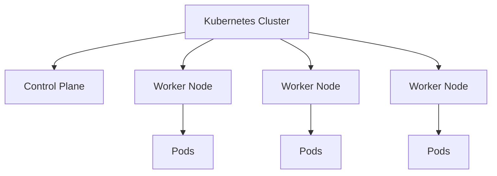
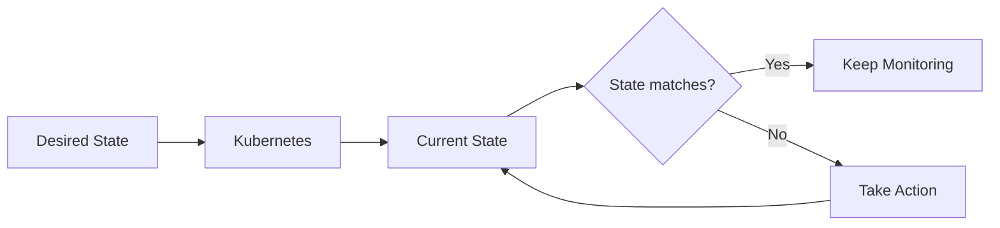
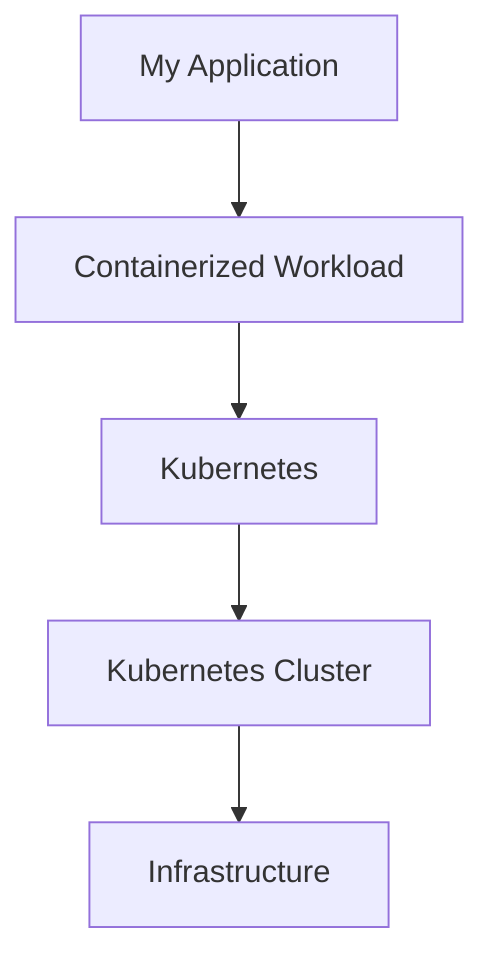

## Introduction

**Kubernetes** is an open-source platform for **container orchestration**.

بمعنى أبسط، Kubernetes بيساعدني إني **أشغّل، أدير، وأراقب الـcontainerized applications** على مجموعة من الـmachines بشكل automated.

لما يكون عندي application صغيرة، ممكن أشغّل الـcontainers بتاعتها بشكل مباشر باستخدام Docker أو أي Container Runtime.

لكن لما الـapplication تكبر ويبقى عندي:

* Multiple containers
* Multiple servers
* Multiple application instances
* Network communication between services
* Need for scaling
* Container failures
* Continuous deployments

إدارة كل ده manually بتبدأ تبقى صعبة.

هنا بيظهر دور Kubernetes.

> **Kubernetes automates the deployment, scaling, management, and operation of containerized applications.**

---

## 1. What does "Container Orchestration" mean?

قبل ما أفهم Kubernetes، لازم أفهم معنى **Container Orchestration**.

كلمة *Orchestration* هنا معناها إن فيه system مسؤول عن تنسيق وإدارة مجموعة من الـcontainers بدل ما أتعامل مع كل container بشكل منفصل.

مثلاً عندي application مكونة من:

```text
                 My Application
                      │
        ┌─────────────┼─────────────┐
        ▼             ▼             ▼
      Frontend       API          Database
      Container    Container      Container
```

لو application بسيطة، ممكن أدير الـcontainers دي manually.

لكن لو بقى عندي:

```text
Frontend × 5
API × 10
Worker × 5
Database × 2
```

وكل واحدة موجودة على servers مختلفة، تبدأ تظهر مشاكل كتير:

* مين يشغّل الـcontainers؟
* الـcontainer يتحط على أنهي server؟
* لو container وقع، مين يشغله تاني؟
* لو traffic زاد، أعمل scaling إزاي؟
* إزاي الـservices تلاقي بعضها؟
* إزاي أعمل update بدون downtime؟
* إزاي أعرف حالة الـapplications؟
* إزاي أضمن إن الـdesired number of instances شغال؟

عندنا **Container orchestration** هو المجال اللي بيحل النوع ده من المشاكل.

وKubernetes هو واحد من أشهر platforms المستخدمة لهذا الغرض.

---

## 2. Kubernetes in Simple Terms

ممكن أبسط Kubernetes بالشكل ده:

```text
        Containerized Applications
                  │
                  ▼
             Kubernetes
                  │
       ┌──────────┼──────────┐
       ▼          ▼          ▼
    Deploy      Scale      Manage
       │          │          │
       └──────────┼──────────┘
                  ▼
        Running Applications
```

بدل ما أقول:

> "شغّل container على server رقم 1."

أقدر أقول لـKubernetes:

> "I want 3 instances of this application running."

وKubernetes يتولى عملية تحقيق الـdesired state دي.

---

## 3. Kubernetes Manages Applications, Not Just Containers

من المهم إني ما أختزلش Kubernetes في إنه:

> "Tool بيشغل Docker containers."

ده تبسيط زيادة.

عندنا Kubernetes بيدير **containerized workloads** من خلال مجموعة من abstractions والـresources.

مثلاً:

```text
Application
    │
    ▼
 Kubernetes Resources
    │
    ├── Pods
    ├── Deployments
    ├── Services
    ├── ConfigMaps
    ├── Secrets
    └── Volumes
```

الـcontainers نفسها بتشتغل داخل **Pods**، والـPods بتتم إدارتها باستخدام resources مختلفة حسب احتياج الـapplication.

هنشرح كل concept بالتفصيل بعدين.

---

## 4. Kubernetes as a Desired-State System

واحدة من أهم الأفكار في Kubernetes هي مفهوم **Desired State**.

بدل ما أدي Kubernetes سلسلة commands أقول له يعملها واحدة واحدة، أنا غالبًا بحدد:

> **What I want the final state to look like.**

مثلاً:

```yaml
replicas: 3
```

ده معناه إن الـdesired state هو:

```text
I want 3 running instances.
```

Kubernetes بيقارن بين:

```text
Desired State
      │
      │
      ▼
Current State
```

ولو فيه difference، Kubernetes بيحاول يعمل changes للوصول للحالة المطلوبة.

مثلاً:

```text
Desired State
3 Pods
   │
   │ compare
   ▼
Current State
2 Pods
   │
   ▼
Kubernetes takes action
   │
   ▼
3 Pods
```

وده مفهوم أساسي جدًا في Kubernetes وهيرجع معانا باستمرار.

---

## 5. Kubernetes and Automation

بدون Kubernetes، ممكن تكون مسؤول عن حاجات كتير manually:

```text
Deploy
  ↓
Start Containers
  ↓
Check Health
  ↓
Replace Failed Containers
  ↓
Scale
  ↓
Configure Networking
  ↓
Update Application
  ↓
Monitor
```

Kubernetes بيقدم mechanisms تساعد في أتمتة العمليات دي.

```text
              Kubernetes
                   │
       ┌───────────┼───────────┐
       ▼           ▼           ▼
    Deploy       Scale       Recover
       │           │           │
       └───────────┼───────────┘
                   ▼
          Automated Management
```

المهم إن Kubernetes **مش magic**؛ هو platform فيها components وcontrollers وAPIs بتتعاون عشان تحقق الـdesired state.

---

## 6. Kubernetes at a High Level

ممكن أشوف Kubernetes كطبقة management فوق الـinfrastructure والـcontainer runtime.

```text
┌─────────────────────────────────┐
│       My Applications            │
│      Containerized Workloads     │
└────────────────┬────────────────┘
                 │
┌────────────────▼────────────────┐
│           Kubernetes             │
│                                  │
│  Deployment / Scaling / Network  │
│  Scheduling / Self-Healing / ... │
└────────────────┬────────────────┘
                 │
┌────────────────▼────────────────┐
│        Infrastructure            │
│                                  │
│   VMs / Physical Machines / ...  │
└─────────────────────────────────┘
```

Kubernetes therefore acts as a **management and orchestration layer** between my workloads and the underlying infrastructure.

---

## 7. Kubernetes Cluster

الـKubernetes environment بيتكون من **Cluster**.

الـCluster عبارة عن مجموعة من machines بتشارك في تشغيل وإدارة الـworkloads.

بشكل مبسط:



الـControl Plane مسؤول عن **management and orchestration**، والـWorker Nodes بتشغل الـworkloads.

هندخل في تفاصيل الـCluster Architecture في الصفحة القادمة.

---

## 8. Kubernetes Does Not Replace Containers

Kubernetes مش بديل عن الـcontainers.

الـrelationship بينهم أقرب لكده:

```text
Container
   │
   │ is the unit being run
   ▼
Container Runtime
   │
   ▼
Kubernetes
   │
   │ manages and orchestrates
   ▼
Containerized Workloads
```

Kubernetes يحتاج **Container Runtime** لتشغيل الـcontainers على الـNodes.

ومن أمثلة الـruntimes المستخدمة مع Kubernetes:

* containerd
* CRI-O

فأنا ممكن أفكر فيهم كده:

> **Container Runtime runs the container.**
> **Kubernetes manages the workload and coordinates the environment around it.**

---

## 9. What Problems Does Kubernetes Help Solve?

Kubernetes بيقدم mechanisms لحل مجموعة كبيرة من مشاكل تشغيل الـcontainerized applications.

### Deployment

يساعدني في تشغيل application workloads بطريقة declarative وautomated.

### Scaling

أقدر أزود أو أقلل عدد الـapplication instances حسب احتياجي.

### Self-Healing

لو workload اتعرض لمشكلة، Kubernetes عنده mechanisms تساعد في إعادة الـworkload للحالة المطلوبة.

### Service Discovery

بيوفر mechanisms تساعد الـapplications والـservices إنها تتواصل مع بعضها داخل الـcluster.

### Load Distribution

يساعد في توجيه الـnetwork traffic إلى الـappropriate application instances.

### Rolling Updates

يساعد في تحديث الـapplication تدريجيًا بدل ما أوقف كل الـinstances مرة واحدة.

### Resource Management

أقدر أحدد resource requirements وlimits للـworkloads.

كل feature من دول هتتشرح بالتفصيل في أجزاء لاحقة.

---

## 10. A Simple Example

افترض إن عندي web application:

```text
                 Web Application
                       │
              ┌────────┼────────┐
              ▼        ▼        ▼
             Pod      Pod      Pod
              │        │        │
           App #1    App #2    App #3
```

وأنا عايز دائمًا يكون عندي:

```text
3 application instances
```

لو واحد من الـPods اختفى:

```text
Desired = 3
Current = 2
```

Kubernetes يلاحظ إن الـcurrent state مش مطابق للـdesired state، ويبدأ mechanisms لتحقيق الحالة المطلوبة.

```text
        Desired State
        3 Pods
           │
           ▼
      Kubernetes
           │
           ▼
     Current State
        2 Pods
           │
           ▼
      Reconciliation
           │
           ▼
        3 Pods
```

الفكرة دي من أهم الأفكار اللي لازم تفضل ثابتة في دماغي وأنا بتعلم Kubernetes.

---

## 11. Kubernetes Declarative Model

Kubernetes بيعتمد بشكل كبير على **Declarative Configuration**.

يعني بدل ما أقول:

```text
1. Start container
2. Start another container
3. If one dies, start it again
4. Keep 3 instances running
```

أنا بحدد الـdesired state:

```yaml
replicas: 3
```

وأقول لـKubernetes:

> **This is the state I want.**

وبعد كده Kubernetes يتولى عملية الوصول والمحافظة على الحالة دي.



ده بيمهد لمفهوم مهم جدًا اسمه:

**Reconciliation Loop**

واللي هنشوفه كتير جدًا بعدين.

---

## 12. Kubernetes in One Sentence

لو محتاج أفتكر Kubernetes في جملة واحدة:

> **Kubernetes is an open-source container orchestration platform that automates the deployment, scaling, management, and operation of containerized workloads across a cluster of machines.**

---

## 13. Mental Model

في النهاية، الصورة اللي عايز أخرج بيها من الصفحة دي هي:



لكن العلاقة الحقيقية أهم من مجرد الشكل:

```text
Application
     │
     ▼
Containerized Workload
     │
     ▼
   Kubernetes
     │
     ├── Deploy
     ├── Scale
     ├── Schedule
     ├── Manage
     ├── Recover
     └── Network
     │
     ▼
 Kubernetes Cluster
     │
     ▼
Infrastructure
```
