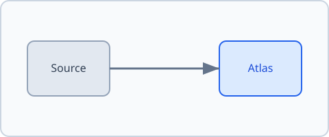
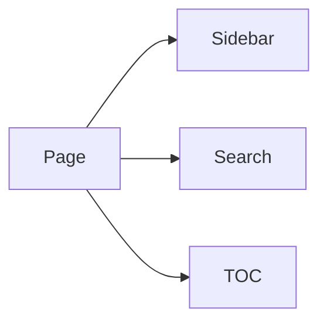

import Figure from '../../../../src/components/Figure.astro';
import placeholder from './images/placeholder.svg';
import resourcePdf from './resources/cheatsheet.pdf';

هذه صفحة اختبار لإثبات أن إنشاء ملف واحد داخل `content/` يكفي للحصول على صفحة
مبنية بالكامل: تظهر في القائمة الجانبية، ومسار التنقل، والبحث، ويُبنى رابطها
تلقائياً. لا يوجد في هذه الصفحة أي محتوى تعليمي.

<Callout type="note">
  المكوّنات مثل `Callout` و`Steps` و`Figure` و`PdfCard` متاحة **بدون استيراد** —
  استورد فقط الأصول (الصور وملفات PDF).
</Callout>

## مكوّنات MDX

<Steps>
  <li>أنشئ ملف `index.mdx` داخل مجلد الموضوع.</li>
  <li>أضف الحقول المطلوبة في الواجهة الأمامية: `title` و`category`.</li>
  <li>شغّل `npm run build` — الصفحة تظهر في التنقل والبحث تلقائياً.</li>
</Steps>

<Callout type="tip" title="تلميح">هذا عنوان مخصص لمكوّن Callout.</Callout>

<Callout type="warning">تنبيه تجريبي للتحقق من ألوان الأنواع.</Callout>

## الصور والموارد

<Figure src={placeholder} alt="مخطط تجريبي بسيط" caption="صورة موضوعة داخل مجلد images/ بجانب الصفحة." />

أو مباشرة بصيغة Markdown دون أي استيراد:



ملف PDF داخل `resources/` بجانب الصفحة:

<PdfCard href={resourcePdf} title="ملف PDF تجريبي" />

## مخطط Mermaid



## شيفرة وجدول

```bash
npm run build
```

| الحقل     | مطلوب | الافتراضي  |
| --------- | ----- | ---------- |
| title     | نعم   | —          |
| category  | نعم   | —          |
| order     | لا    | `0`        |
