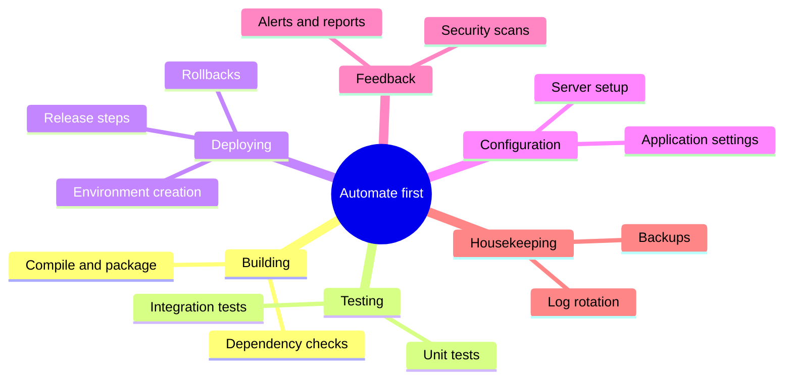
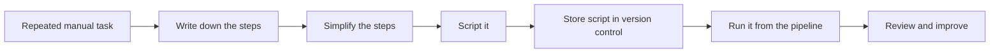
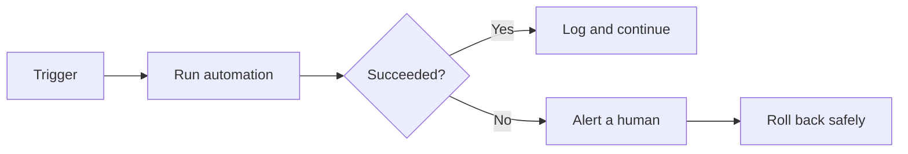
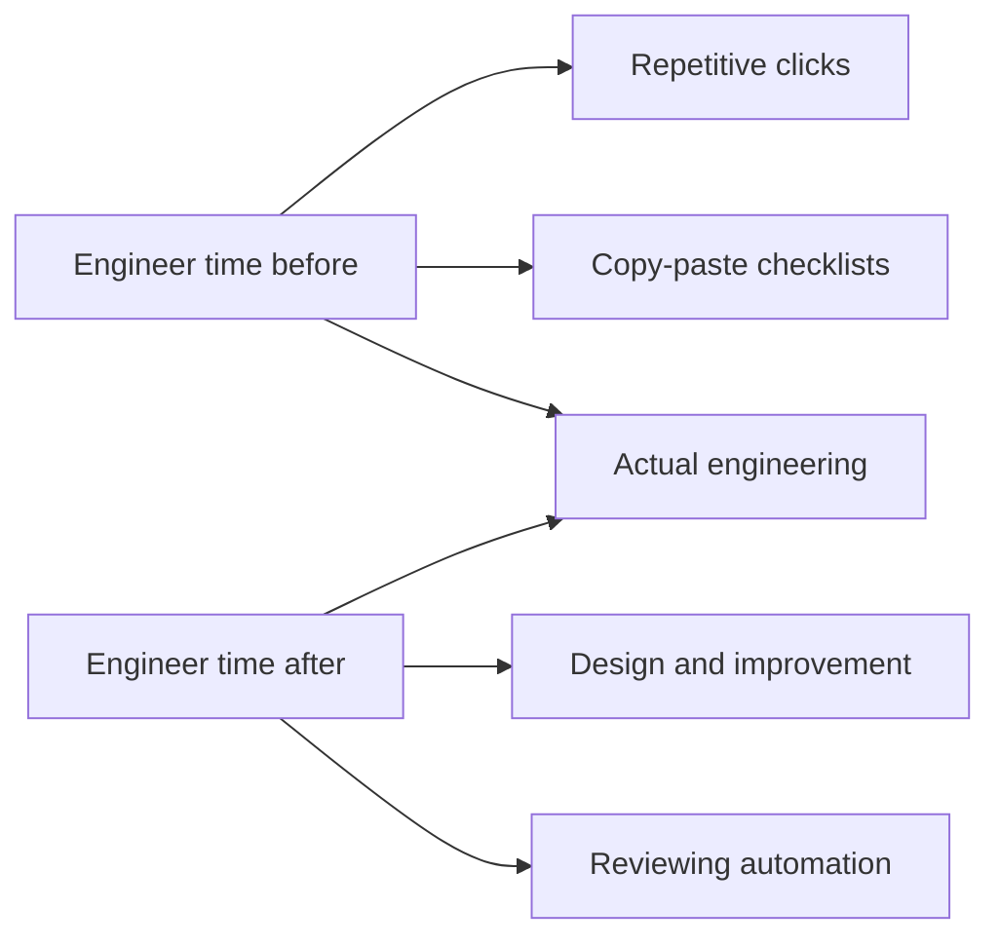

If there is one habit that separates a DevOps-minded engineer from everyone else, it is this:

> Repetitive work is a bug in the way you work — fix it by automating it.

Automation is where DevOps stops being philosophy and becomes daily practice. This article is about the **mindset** behind it: what to automate, how to do it safely, and what to leave alone.

## Why Automate?

Compare the two ways of doing the same task — deploying an application:

| | Manual deployment | Automated deployment |
| --- | --- | --- |
| Speed | 45 minutes of clicking | 4 minutes, unattended |
| Consistency | Depends on mood and memory | Identical every time |
| Errors | Typo at 2 a.m. possible | Script never forgets a step |
| Availability | Needs a person free | Runs any time, anywhere |
| Knowledge | In one person's head | In version control, reviewable |
| Cost of a new team member | Weeks of shadowing | Reads the pipeline |

Automation gives you four things at once: **speed, consistency, reliability, and shared knowledge**.

## What to Automate First

Not everything deserves automation. Start where repetition, risk, and waiting meet:



A simple priority formula:

```text
First  = tasks you repeat often and that break when done by hand
Next   = tasks that block other people (waiting time)
Later  = rare, creative work
Never  = things nobody has done successfully yet
```

## The Core Rules of the Automation Mindset

Senior engineers follow a handful of unwritten rules:

**1. If you do it twice by hand, script it the third time.**
One-off work does not need automation. Repetition does.

**2. Automate a *good* process first.**
Automation multiplies whatever you feed it — including mistakes. Clean up the process on paper before coding it.



**3. Version everything.**
A script on one laptop is a rumour. Scripts, tests, and infrastructure definitions belong in **Git**, like any other code — reviewed, history-tracked, and shared.

**4. Make it idempotent.**
Running an automated task twice should give the same result as running it once — no duplicate users, no broken config. The classic pattern:

```bash
# Not idempotent: fails or duplicates the second time
useradd deploy

# Idempotent: safe to run repeatedly
id deploy >/dev/null 2>&1 || useradd deploy
```

**5. Automation must be observable and reversible.**
You should be able to see what an automation did — and undo it. A deploy script that cannot roll back is a one-way door.



**6. Never automate what you do not understand.**
Automation of a mystery produces mystery at scale. Understand the manual process first — then encode it.

## Common Mistakes

- **Automating dysfunction** — a broken process, run faster, fails faster.
- **Big-bang automation** — trying to automate everything at once. Automate one task, prove it, move on.
- **No human gate for dangerous actions** — deleting data or touching production usually deserves review or approval.
- **Skipping version control** — "temporary" scripts live forever, unreviewed.
- **Set and forget** — automation needs tests and monitoring too; a silently broken pipeline is worse than manual work.

## The Payoff: You Automate Yourself Out of the Boring Parts

The goal is not to remove humans — it is to remove **drudgery**:



Freed from clicking buttons, engineers spend their time on the work that needs judgment — which is exactly what you want humans doing.

## What Should You Remember?

- Automation is DevOps **in action**: fast, repeatable, identical every time.
- Automate **repetitive, error-prone, high-wait** tasks first — not everything.
- Follow the rules: script the third repetition, fix the process first, version everything, make it idempotent, keep it observable and reversible.
- **Never automate what you don't understand.**
- The point is to free humans for judgment work — machines for the boring parts.
- Everything in the next article (CI/CD) is this mindset applied to delivery.
