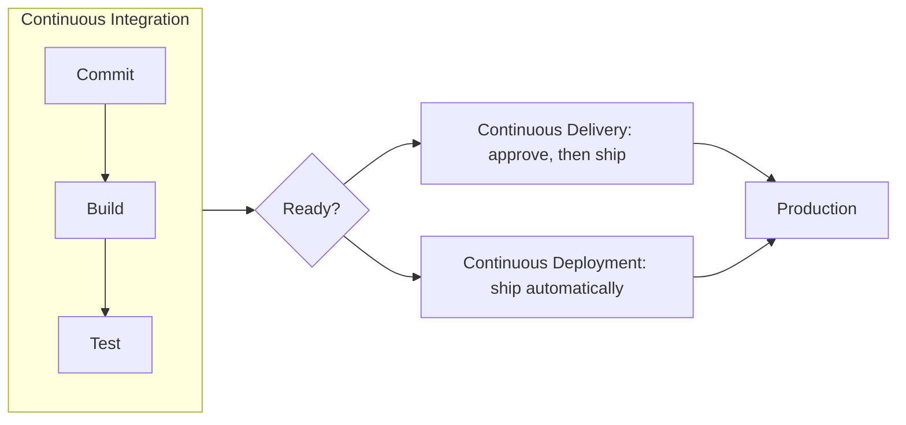
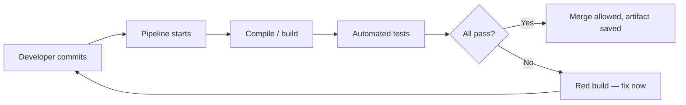
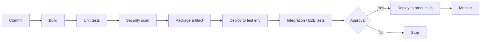
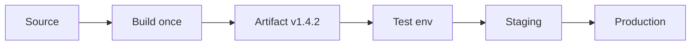

If automation is the DevOps mindset, **CI/CD is where that mindset gets a permanent job**. It is the automated backbone that takes code from a developer's laptop to production safely — many times a day.

First, unpack the acronym.

## What CI/CD Actually Stands For

```text
CI  = Continuous Integration        (merge and test continuously)
CD  = Continuous Delivery           (always ready to release)
CD  = Continuous Deployment         (release automatically)
```

Two different things share the letters **CD** — keep them straight:

| Term | What it means | Humans involved at release? |
| --- | --- | --- |
| Continuous Integration | Every change is built and tested automatically within minutes | No |
| Continuous Delivery | The software is *always in a releasable state*; a human presses the final button | Yes — one approval |
| Continuous Deployment | Every passing change reaches production automatically | No |



Most teams start with **CI + Continuous Delivery** (a human approves the final step) and grow toward Continuous Deployment as trust in the pipeline increases.

## Continuous Integration: The Discipline

CI is a practice, not just a server:

1. Developers **push small changes** to a shared mainline frequently (daily, ideally).
2. An automated pipeline **builds and tests** each change within minutes.
3. If the build or tests fail, it is **fixed immediately** — before anything else starts.



Two rules make it work:

- **The build must stay green.** A broken mainline blocks everyone — so the team treats fixing it as the top priority (the old factory rule: "stop the line").
- **Changes are small.** A two-line change that breaks something is easy to find; a 2,000-line merge from three weeks ago is not.

## Anatomy of a Pipeline

A full CI/CD pipeline chains stages together, each one a quality gate:



What each stage does:

- **Build** — compile/package the code; fails fast on syntax or dependency errors.
- **Unit tests** — fast checks of individual pieces (seconds).
- **Security scan** — catch known vulnerabilities before shipping.
- **Package artifact** — create one versioned, immutable package.
- **Deploy to test** — put that package into a real environment.
- **Integration/E2E tests** — test the whole system working together (slower).
- **Approval** — a human confirms the release (in Continuous Delivery).
- **Deploy to production** — same artifact, new environment.
- **Monitor** — watch the change in the real world; feed problems back.

## Build Once, Promote Everywhere

A core pipeline principle:

> The artifact tested in staging is **byte-for-byte the same** one that reaches production.



If you rebuild for each environment, you are testing something different from what you ship — the pipeline's guarantees evaporate.

## Why Teams Love It

- **Feedback in minutes**, not weeks — mistakes surface while context is fresh.
- **Releases become boring** — routine, low-risk, repeatable.
- **Documentation by code** — the pipeline *is* the deploy manual.
- **Consistency** — the same steps run for every change, day or night.
- **Confidence** — hundreds of small releases beat one giant risky one.

## Common Mistakes

- **Long pipelines** — if feedback takes hours, people batch changes again. Split fast (unit) and slow (E2E) stages.
- **Flaky tests** — tests that fail randomly get ignored; then nothing is trusted. Fix or quarantine them immediately.
- **Deploying from a laptop** — "works on my machine" reappears. Production deploys only from the pipeline.
- **No rollback plan** — pipelines must be able to undo as easily as they apply.
- **Manual configuration on the way** — every manual step is a future 2 a.m. mistake; automate or document it as code.

## What Should You Remember?

- **CI**: every change is built and tested automatically, within minutes, on a green mainline.
- **Continuous Delivery** keeps software always releasable; a human presses the final button.
- **Continuous Deployment** removes that button — passing changes ship themselves.
- A pipeline is a series of **gates**: build → test → scan → package → deploy → approve → monitor.
- **Build once, promote the same artifact** through every environment.
- Start with CI + one deployment step, then expand — pipelines grow with trust.
