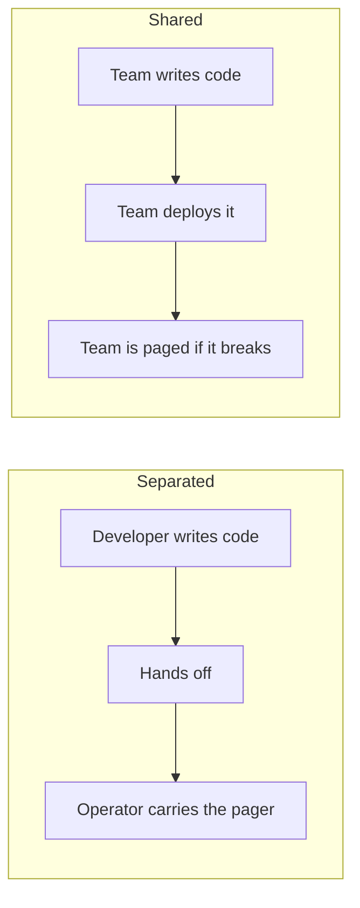
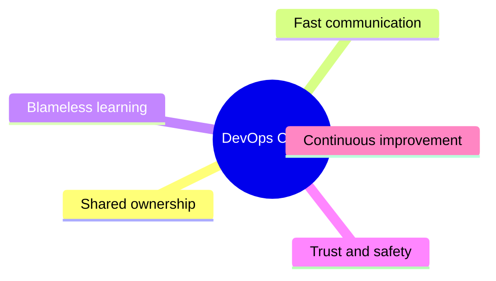
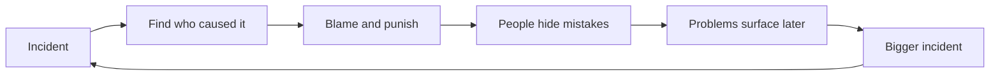
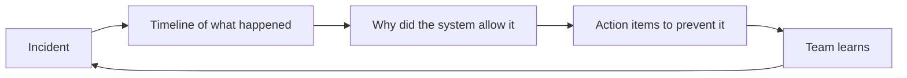
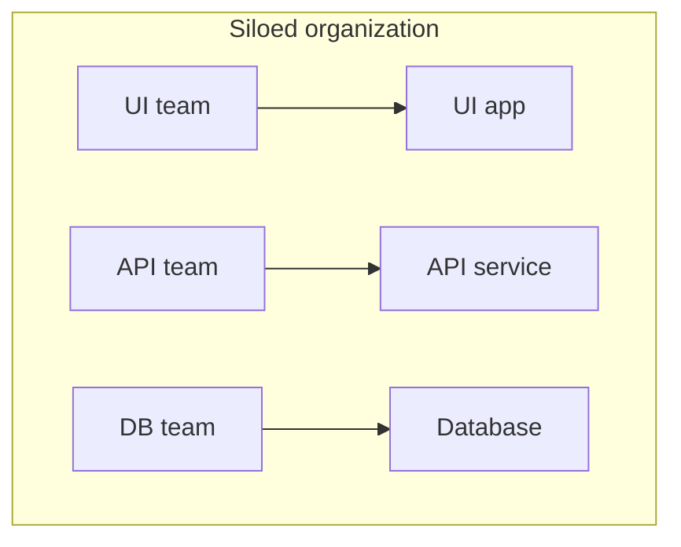

Here is a truth every senior engineer learns the hard way:

> You can buy every popular tool and still fail at DevOps — because tools amplify how a team works; they do not replace it.

**Culture is the foundation.** Automation and pipelines sit on top of it. Change the culture first, and the tools become powerful. Skip the culture, and the tools become expensive decoration.

## Shared Ownership: "You Build It, You Run It"

In separated organizations, developers write code and hand it over; operations carries the pager at night. Neither side feels the full consequences of their decisions.

DevOps shares the load:

When the person who writes the code also helps operate it, quality changes:

- Code gets **simpler** (nobody wants to be paged for a clever hack).
- Deployments get **safer** (the author is watching).
- Feedback gets **faster** (production reality reaches the developer directly).

"Shared" does not mean everyone does everything. It means **the team owns the outcome together**.

## Communication and Collaboration

Culture shows up in daily habits:

- **Small, cross-functional teams** — developer, tester, and operations knowledge in one group instead of three tickets.
- **Talking early** — operations joins planning before the code is written, not after.
- **ChatOps** — conversations happen where the work happens: alerts, deployments, and commands in a shared chat channel, visible to everyone.
- **Transparent work** — anyone can see what is being deployed, when, and why.

## Blameless Postmortems

When something breaks at 2 a.m., the first reaction decides the culture.

**Blame culture** looks like this — the loop feeds on itself:

**Blameless culture** separates the person from the system:

A blameless postmortem asks *"what conditions made this possible?"* — missing tests, unclear alerts, a risky deploy step — instead of *"whose fault was it?"*. People report mistakes **early**, while mistakes are still small.

> **Note:** Blameless does not mean consequence-free. It means the fix targets the process, not the person — so the next person cannot hit the same trap.

## Trust and Psychological Safety

Psychological safety is the belief that you will not be punished for speaking up. It matters because DevOps depends on people saying uncomfortable things early:

- "This deploy step scares me — can we automate it?"
- "I don't understand this alert."
- "I think we should roll back."

Teams without safety stay silent — and silence is how small problems become outages.

## Culture in Practice

A quick health check for your team:

| Area | Unhealthy (wall) | Healthy (DevOps) |
| --- | --- | --- |
| Deployments | "That's ops' problem" | "We ship and support what we build" |
| Incidents | Who do we blame? | What do we fix? |
| Failures | Hidden, punished | Shared, analyzed |
| Knowledge | Hoarded in silos | Documented and taught |
| Changes | Big and scary | Small and routine |
| Feedback | Annual reviews | Real-time metrics and alerts |

## Conway's Law: Your Org Chart Shapes Your Software

There is a famous observation called **Conway's Law**: the software you build tends to mirror the communication structure of the organization that builds it.

Three teams that rarely talk often produce three pieces that barely fit together — regardless of how good the architecture diagram looks.

DevOps deliberately uses this for good: put people who must deliver together **in one team**, and the software grows as one coherent system.

## What Should You Remember?

- **Culture comes before tools** — automation amplifies good collaboration and automates dysfunction faster.
- **Shared ownership**: the team that builds a service also helps run and improve it.
- **Blameless postmortems** turn incidents into fixes instead of fear.
- **Psychological safety** keeps small problems visible while they are still small.
- **Conway's Law** cuts both ways: organize teams around outcomes, and the architecture follows.
