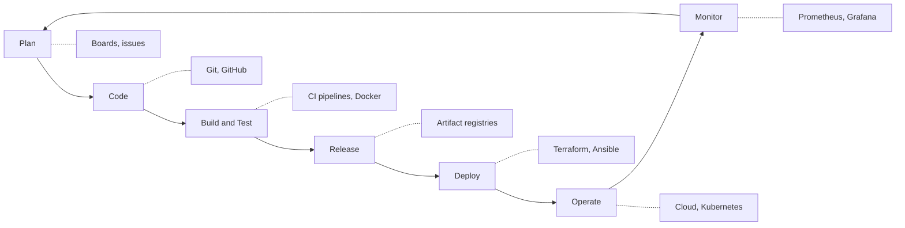
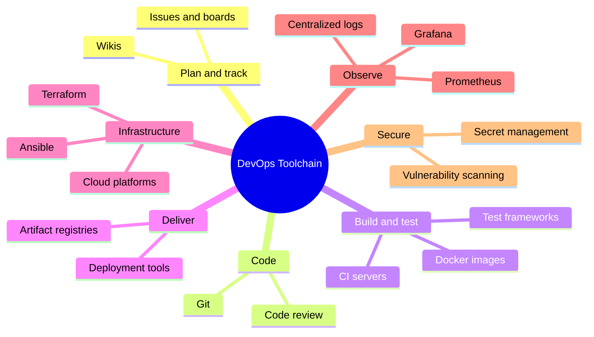
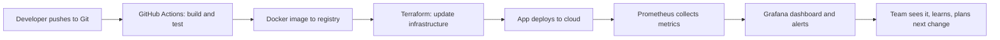

By now you have seen the ideas: culture, lifecycle, environments, automation, pipelines. This article zooms out to the **tools** that support all of it — as one connected toolchain, not a random shopping list.

Remember the rule from the first article:

> Docker ≠ DevOps, Terraform ≠ DevOps, Jenkins ≠ DevOps. Tools **support** the practices; they never replace them.

## The Toolchain Across the Lifecycle

Each lifecycle phase has tools that keep it fast and reliable:



## Toolchain Categories

| Category | Purpose | Example tools |
| --- | --- | --- |
| Version control | Every change, tracked and reviewable | Git, GitHub, GitLab |
| CI/CD | Automated build, test, deploy | GitHub Actions, GitLab CI, Jenkins |
| Containers | Package apps identically everywhere | Docker, containerd |
| Orchestration | Run many containers reliably | Kubernetes |
| Infrastructure as Code | Environments defined in files | Terraform, Ansible, Pulumi |
| Cloud platforms | Compute, storage, networking on demand | AWS, Azure, GCP |
| Monitoring & metrics | See health in real time | Prometheus, Grafana |
| Logging | Search what happened, and when | ELK Stack, Loki |
| Secrets & security | Safe credentials, scanning | Vault, Trivy, Snyk |
| Collaboration | Chat, alerts, ChatOps | Slack, Mattermost |

## The Whole Map at a Glance



## A Simple Example Stack

You do not need everything. Here is a small, complete toolchain telling one story — a commit becoming a monitored production service:



Six tools, one loop — each with exactly one job.

## How to Choose Tools (Senior Advice)

- **Start from the practice, not the tool.** Need repeatable builds? Then look at CI tools. Liking a tool first leads to solutions without problems.
- **Prefer managed services early.** A team of five should not run its own Jenkins server and log cluster. Let the cloud vendor do the undifferentiated work.
- **Boring technology wins.** Well-understood tools with large communities beat shiny ones with three contributors.
- **Match your team's skills.** The best tool nobody knows is worse than the good tool everyone knows.
- **One tool per need, no overlap.** Three overlapping monitoring stacks means three places to check during an outage.
- **Avoid tool sprawl.** Every tool is maintenance, integration, and learning cost. Revisit and prune regularly.

```text
Practice  →  Problem  →  Tool  →  Measure  →  Keep or replace
```

## What Should You Remember?

- The toolchain is a **connected system across the lifecycle** — plan, code, build, deploy, operate, monitor.
- Categories matter more than brands: version control, CI/CD, containers, IaC, cloud, monitoring, security.
- A **small, complete stack** beats a large collection of half-used tools.
- Choose tools **after** understanding the practice and the problem — managed, boring, and team-friendly by default.
- Tools support DevOps; **culture, small batches, and feedback loops** are still DevOps.
