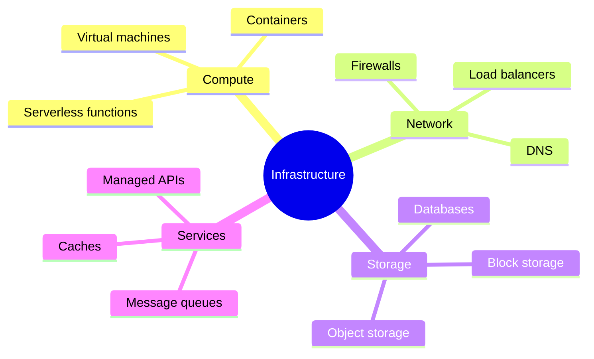
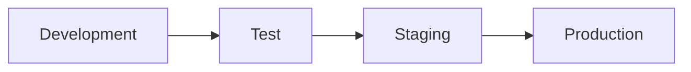
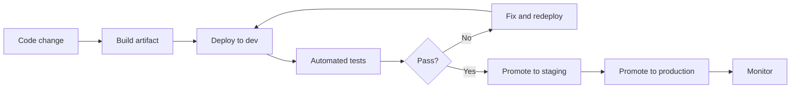
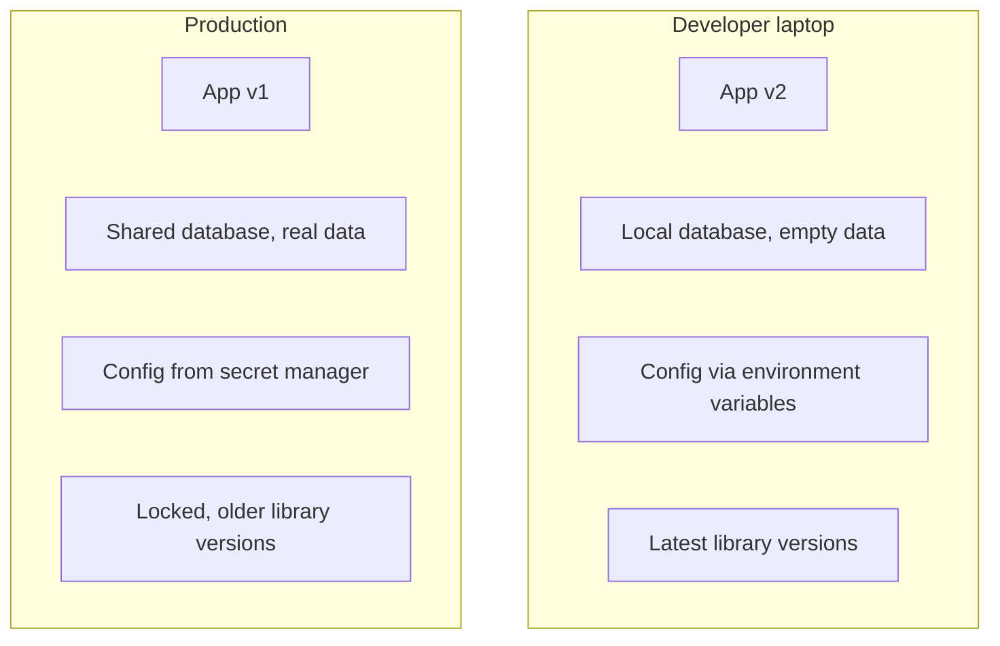
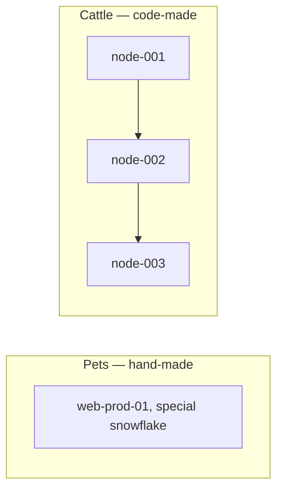

Code cannot run by itself. It needs servers, networks, storage, databases, and configuration — all the things we group under **infrastructure**. And it needs to run in several distinct places, called **environments**.

This article explains both, and why their consistency is a DevOps obsession.

## What Is Infrastructure?

Infrastructure is everything the software runs on:

Traditionally, engineers ordered these by hand: open a ticket, wait days, receive a server with a sticky note of its purpose. In modern cloud environments, the same things are created **in minutes — often by code**, which is a topic for later (Infrastructure as Code).

## Why So Many Environments?

Software passes through several distinct stages on its way to users. Each stage needs its own copy of the infrastructure:

| Environment | Purpose | Audience |
| --- | --- | --- |
| Development (dev) | Daily experiments, work in progress | Developers |
| Test / QA | Formal testing of new changes | Testers, product |
| Staging | Final rehearsal — mirrors production | Team before release |
| Production (prod) | Real users, real data | Everyone |

Each arrow is a safety gate: a change proves itself in the cheap, low-risk environments before it can touch real users.

## The Path of a Change

Notice the important property: the **same artifact** moves through the environments. It is built once and promoted — not rebuilt at each step (rebuilding risks "it worked in staging but differs in prod").

## "It Works on My Machine"

The classic developer joke is a real and expensive problem:

> The code runs perfectly on the developer's laptop — and fails in production.

Why? The environments **drift apart**:

**Environment parity** is the fix: make environments as similar as possible — same OS, same dependency versions, same configuration style — so a change that passes in one passes everywhere.

Modern tools that help:

- **Containers (Docker)** — package the app with its dependencies, identical in every environment.
- **Infrastructure as Code (Terraform, Ansible)** — define environments in files, create them identically every time.
- **Configuration as Code** — settings live in version control, not on one engineer's laptop.

## Pets vs Cattle

A classic analogy that captures the DevOps attitude toward infrastructure:

- **Pets**: you name them, nurture them, and are sad when one dies — you fix it by hand. (Hand-made servers with unique names.)
- **Cattle**: they have numbers, are identical, and if one fails you simply replace it. (Servers created from code, replaceable anytime.)

Cattle-style infrastructure is what makes fast, safe delivery possible: you never fix a snowflake — you replace it from the template.

## Manual vs as Code

| | Manual infrastructure | Infrastructure as code |
| --- | --- | --- |
| Creating an environment | Tickets and days | Minutes, self-service |
| Consistency | Depends on who did it | Identical every time |
| Changes | Edited in place, invisible | Reviewed like code |
| Recovery | Rebuild by memory | Recreate from files |
| Documentation | Out-of-date wiki | The code itself |

## What Should You Remember?

- **Infrastructure** = everything software runs on: compute, network, storage, services.
- **Environments** (dev → test → staging → prod) are safety gates before real users.
- Promote **the same artifact** through environments — never rebuild on the way.
- **Environment parity** kills "it works on my machine".
- Treat infrastructure like **cattle, not pets**: built from code, identical, replaceable.
- Keeping environments consistent is the foundation for automation and CI/CD — the next articles.
