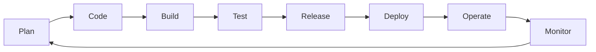
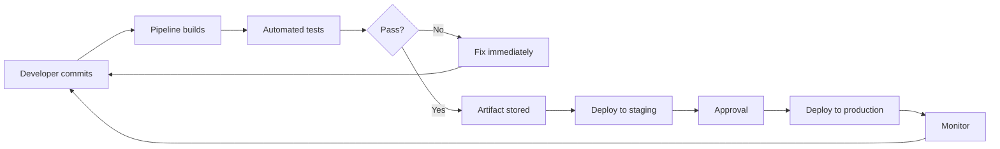
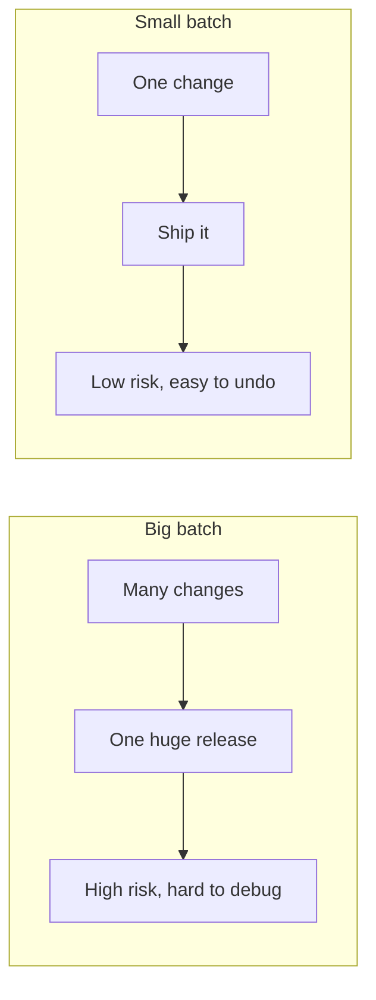
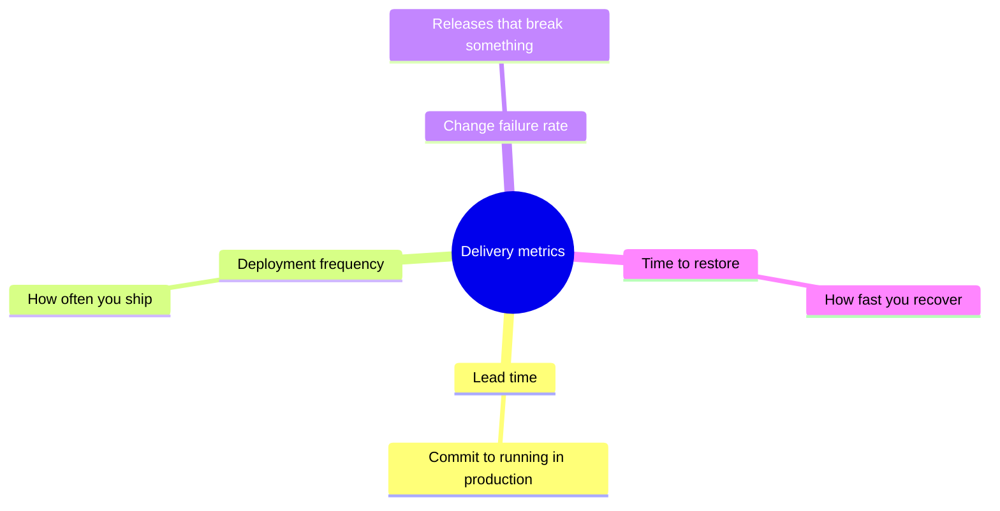

Every piece of software you use went through a journey: someone had an idea, code was written, it was tested, released, deployed, and watched in production. That journey is the **Software Delivery Lifecycle (SDLC)**.

DevOps does not invent new phases — it makes the existing ones **fast, automated, and connected**.

## The Phases

| Phase | What happens | DevOps contribution |
| --- | --- | --- |
| Plan | Decide what to build next | Operations and testers join planning |
| Code | Write and review the change | Small changes, version control |
| Build | Turn source into runnable software | Automated, repeatable builds |
| Test | Verify it works | Automated tests on every change |
| Release | Package a versioned, shippable artifact | Artifacts built once, promoted everywhere |
| Deploy | Put it into environments | One-command or automatic deploys |
| Operate | Keep systems running | Infrastructure as code, monitoring |
| Monitor | Watch real behavior, collect feedback | Metrics and alerts feed the next plan |

The last arrow matters most: **monitoring feeds planning**. The lifecycle is a loop, not a line.

## One Change, End to End

What does a single change look like when the lifecycle is DevOps-style?

From commit to production can take **hours instead of weeks** — and if something is wrong, the pipeline stops it before users ever see it.

## Big Batches vs Small Batches

The biggest practical difference DevOps makes is the **size of the change**.

| | Big batch (monthly release) | Small batch (daily releases) |
| --- | --- | --- |
| Risk per release | High | Low |
| When bugs appear | Late, mixed with many changes | Immediately, one change to inspect |
| Rollback | Painful and rare | Trivial and common |
| Fear level | High | Low |
| Learning speed | Slow | Fast |

Small batches are the single most reliable way to make delivery safer. If you remember one mechanism from this article, remember that one.

## The Four Key Metrics

How do you know your delivery is improving? The industry standard (from the **DORA** research team) uses four metrics — all easy to understand:

| Metric | Plain question | Better direction |
| --- | --- | --- |
| Lead time | How long from code written to code running? | Shorter |
| Deployment frequency | How often do we release? | More often |
| Change failure rate | What % of releases cause a problem? | Lower |
| Time to restore service | When it breaks, how fast do we fix it? | Faster |

High-performing teams ship **daily or on demand**, restore in **minutes**, keep failures rare — and none of that happens without automation and small changes.

## What Should You Remember?

- The SDLC is a **loop**: plan → code → build → test → release → deploy → operate → monitor → back to plan.
- DevOps does not add phases — it makes each phase **automated, fast, and connected**.
- **Small batches** beat big batches: less risk, faster fixes, more learning.
- The **four metrics** (lead time, deployment frequency, change failure rate, time to restore) tell you if delivery is really improving.
- Feedback from production is part of the lifecycle, not an afterthought.
