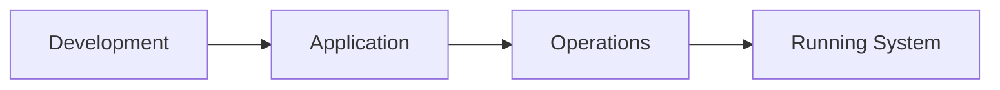
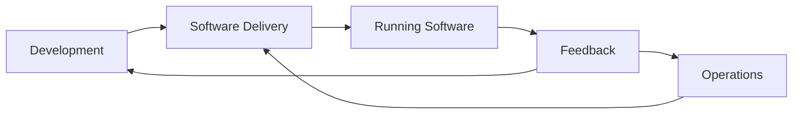
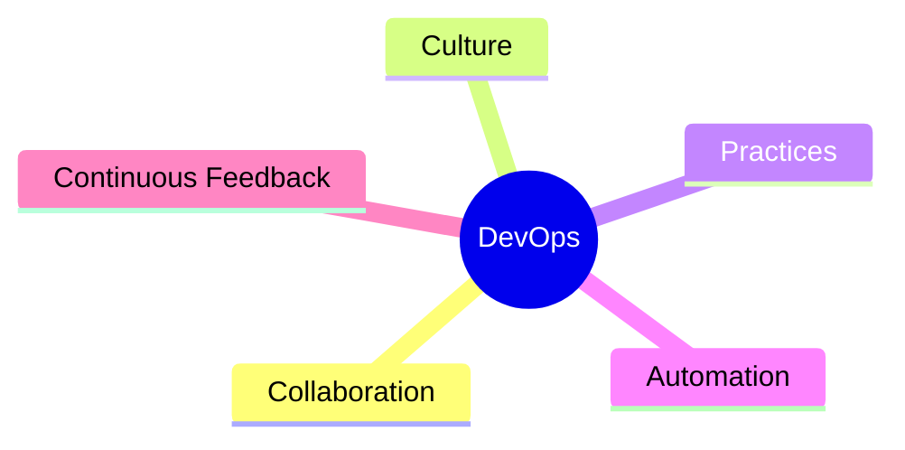
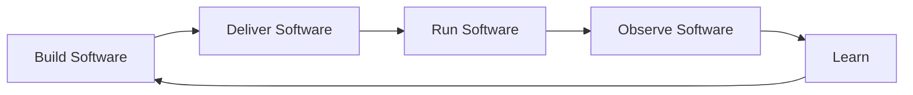

DevOps is a **way of working** that brings **Development** and **Operations** closer together.

The main idea is simple:

> Build, deliver, and operate software as one continuous process instead of treating Development and Operations as completely separate worlds.

DevOps combines **culture, collaboration, practices, and automation** to improve the way software is delivered and operated.

---

## Development and Operations

To understand DevOps, first understand the two sides involved.

### Development

The **Development team** is mainly responsible for building the application.

For example:

- Writing code
- Implementing features
- Fixing bugs
- Testing application logic
- Building new versions of the software

### Operations

The **Operations team** is mainly responsible for running and maintaining the application.

For example:

- Managing infrastructure
- Deploying applications
- Managing servers and environments
- Maintaining availability
- Monitoring running systems

A simplified model looks like this:



Both sides are necessary.

Development creates the software, while Operations helps keep that software running reliably in real environments.

## The Gap Between Them

The problem starts when these responsibilities become completely separated.

A traditional workflow might look like:


Development may consider the application finished once the code is ready.

Operations may then receive the application and discover that deploying or running it requires additional configuration, dependencies, or infrastructure changes.

This creates a gap between building software and running software.

That gap can lead to:

- Communication problems
- Manual handoffs
- Delays
- Repetitive work
- Environment differences
- Deployment problems
- Slow feedback

DevOps is about reducing this gap.

## DevOps Connects the Two Worlds

Instead of thinking about Development and Operations as two isolated stages, DevOps encourages collaboration across the entire process.



The goal is not necessarily to create one team that does everything.

Development and Operations can still have different responsibilities and areas of expertise.

The important change is that they work together around a shared software delivery process.

## DevOps Is a Way of Working

DevOps is sometimes misunderstood as a specific technology or a specific job.

It is neither.

DevOps is a combination of:



These ideas work together to improve the software delivery lifecycle.

For example, a team may use automation to reduce repetitive deployment work, collaboration to improve communication between Development and Operations, and monitoring to get feedback from production.

## DevOps Is Not a Tool

You will often hear DevOps mentioned together with technologies such as:

- Git
- Docker
- Kubernetes
- GitHub Actions
- Terraform
- AWS
- Prometheus
- Grafana

These technologies can be used to implement DevOps practices.

But:

```text
Docker       ≠ DevOps
Kubernetes   ≠ DevOps
Terraform    ≠ DevOps
AWS          ≠ DevOps
CI/CD        ≠ DevOps
```

They are tools and practices that can support DevOps.

The concept of DevOps is broader than any individual technology.

## A Simple Mental Model

One useful way to think about DevOps is:



Development is not completely separated from Operations.

Instead, software moves through a continuous cycle where teams can build, deliver, operate, observe, learn, and improve.

The specific tools used to implement this process can change from one organization to another.

The underlying principles remain.

## What Should You Remember?

If you remember only a few things from this article, remember these:

- DevOps is a way of working, not a single tool.
- It brings Development and Operations closer together.
- It reduces unnecessary silos and handoffs.
- It encourages collaboration and shared responsibility.
- It uses automation and continuous feedback to improve software delivery.
- Tools such as Docker, Kubernetes, Terraform, and CI/CD platforms support DevOps practices, but they are not DevOps itself.

DevOps is about bringing people, processes, and technology together to improve the way software is built, delivered, and operated.
