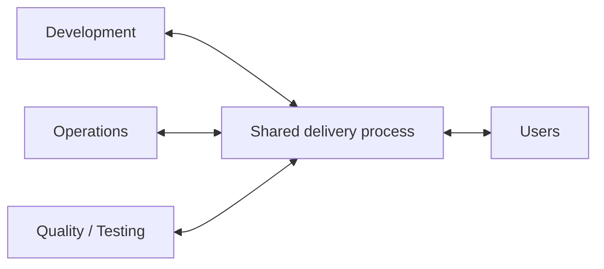
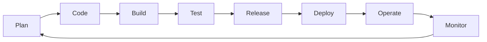
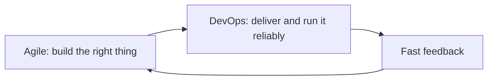

You know **what** DevOps is and **why** teams adopt it. The next question is: **where** does DevOps actually live?

The short answer: **everywhere in the delivery process** — not in one team, not in one tool, and not in one department.

## DevOps Is Not a Team You Hand Work To

The most common misunderstanding is this:

> "We have a DevOps team now — they do all the deployments, so the rest of us don't have to worry about operations."

That simply builds the wall again, with a new name on it.

This "DevOps team" becomes a bottleneck: everyone queues up waiting for them to deploy, and nobody else learns to own the systems.

The correct mental model treats DevOps as **shared practices that connect the people who build software with the people who run it**:

Different roles still exist — developers still write code, operators still know networks and reliability. The change is that **responsibility for delivering and running software is shared**, not thrown over a wall.

## Across the Whole Lifecycle

DevOps touches every phase of the software journey, from idea to production and back:

At each stage, DevOps practices make the step faster and safer:

| Stage | What DevOps changes |
| --- | --- |
| Plan | Developers, operations, and testers plan together |
| Code | Small changes, reviewed quickly, in version control |
| Build | Automated, identical every time |
| Test | Automated tests run on every change |
| Release | Versioned artifacts, ready to ship |
| Deploy | One-click or automatic — no manual checklists |
| Operate | Infrastructure defined as code, repeatable environments |
| Monitor | Real-time feedback that feeds the next plan |

Notice the loop closes: what monitoring learns goes straight back to planning. That loop is the heart of DevOps.

## Next to Agile (and Other Ways of Working)

DevOps often appears in the same conversation as **Agile**. They are related but different:

- **Agile** improves how a team *decides and builds* the software — short iterations, feedback, prioritization.
- **DevOps** improves how that software *reaches users and stays healthy in production*.

You can have Agile without DevOps (fast development, slow releases — a common frustration), and you can automate delivery without Agile. Together they close the gap from idea to user.

You will also meet neighbours of DevOps:

- **DevSecOps** — security built into every stage instead of a final audit.
- **SRE (Site Reliability Engineering)** — Google's engineering approach to running reliable systems.
- **Platform Engineering** — building internal platforms so product teams ship easily.

All of them are extensions of the same idea: make delivery fast, safe, and shared.

## Where You See It in Daily Work

DevOps is not abstract — it shows up in concrete moments:

If a developer can merge a change and watch it reach production the same day — with tests, reviews, and monitoring around it — DevOps is fitting where it belongs.

## What Should You Remember?

- DevOps is a **set of practices spanning the whole lifecycle**, not a department or a job title.
- A dedicated "DevOps team" that performs all deliveries **recreates the old wall** — share ownership instead.
- DevOps sits **next to Agile**: Agile helps you build faster; DevOps helps you deliver and run reliably.
- You can see DevOps in daily work: small changes, automated pipelines, shared on-call, and feedback loops.
- Every stage — plan, code, build, test, release, deploy, operate, monitor — is part of its territory.
