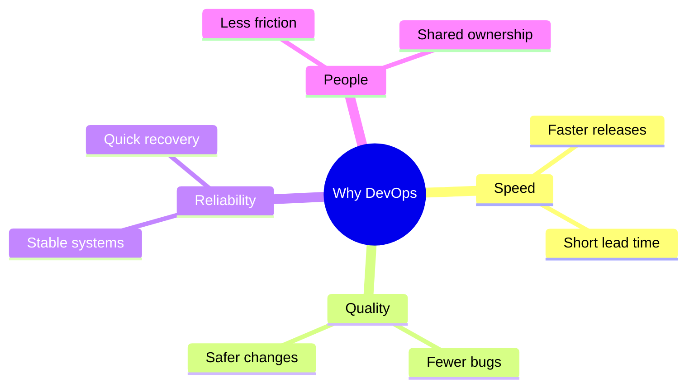

Now you know **what** DevOps is. The natural next question is: **why** do teams bother?

Every modern tech company — and more and more traditional ones — works this way. They do it because the old way of building and running software has real, expensive problems. DevOps is the answer to those problems.

## The Old Way: Two Separate Worlds

In a traditional organization, the work is split between two teams:

- The **Development team** builds new features. It is judged on how fast features arrive.
- The **Operations team** runs the systems. It is judged on stability and uptime.

Each team is optimized for its own goal — and the goals point in opposite directions. Development wants **change**. Operations wants **calm**.

The code is "thrown over the wall" from development to operations. When something breaks after the handoff, that wall becomes a **blame wall**:

The result is a slow cycle of delays, surprises, and finger-pointing.

## What Goes Wrong Without It

The same problems show up again and again in teams that work this way:

- **Slow releases.** Changes batch up for months, then ship as one big, risky release.
- **Manual deployments.** People deploy by hand, at night, following long checklists — so mistakes are common.
- **"It works on my machine."** The developer's environment differs from production, so bugs hide until the very end.
- **Late feedback.** A mistake made on Monday is discovered two weeks later — when it is far more expensive to fix.
- **Fear.** Because releases are big and painful, teams release less often — which makes each release even bigger.

This is not a theory. Teams that live this way spend most of their energy firefighting instead of building.

## How DevOps Fixes This

DevOps attacks those problems directly:

1. **Small, frequent changes.** Instead of one big release, teams ship small pieces continuously — each change is low-risk and easy to undo.
2. **Automation.** Building, testing, and deploying run automatically — fast, repeatable, and the same every time.
3. **Shared ownership.** Development and Operations work toward the same goal: delivering change safely. The wall is gone.
4. **Fast feedback.** Tests and monitoring tell you within minutes when something is wrong — not weeks later.

Instead of a one-way chain that ends in a handoff, the work becomes a **continuous loop** where every stage feeds the next:

Notice there is no "handoff" step. The same team, and the same automated pipeline, carries the change all the way — and what monitoring learns goes straight back into planning the next change.

## The Benefits at a Glance

## Before and After

| | Without DevOps | With DevOps |
| --- | --- | --- |
| Releases | Few, big, risky | Frequent, small, safe |
| Feedback | Weeks or months | Minutes or hours |
| Deployments | Manual checklists | Automated pipelines |
| Failures | Find someone to blame | Find the cause and learn |
| Roles | Separate silos | Shared responsibility |
| Work rhythm | Firefighting | Continuous improvement |

## Why It Matters Beyond the Team

The benefits are not only for engineers:

- Customers get improvements **sooner**.
- Downtime is shorter — less money lost, less reputation damaged.
- Engineers spend their time **building**, not fighting fires.
- The organization can try ideas, learn, and adjust quickly.

Think of it like a relay race: even a perfect handoff loses to a team that simply runs together.

## What Should You Remember?

- DevOps exists because the old way is **slow, risky, and painful**.
- Split goals (speed vs. stability) create conflict — DevOps **aligns** both sides around delivering change safely.
- The payoff: **faster delivery, fewer failures, calmer teams, happier customers**.
- Tools alone do not deliver these benefits — the **way of working** does.
