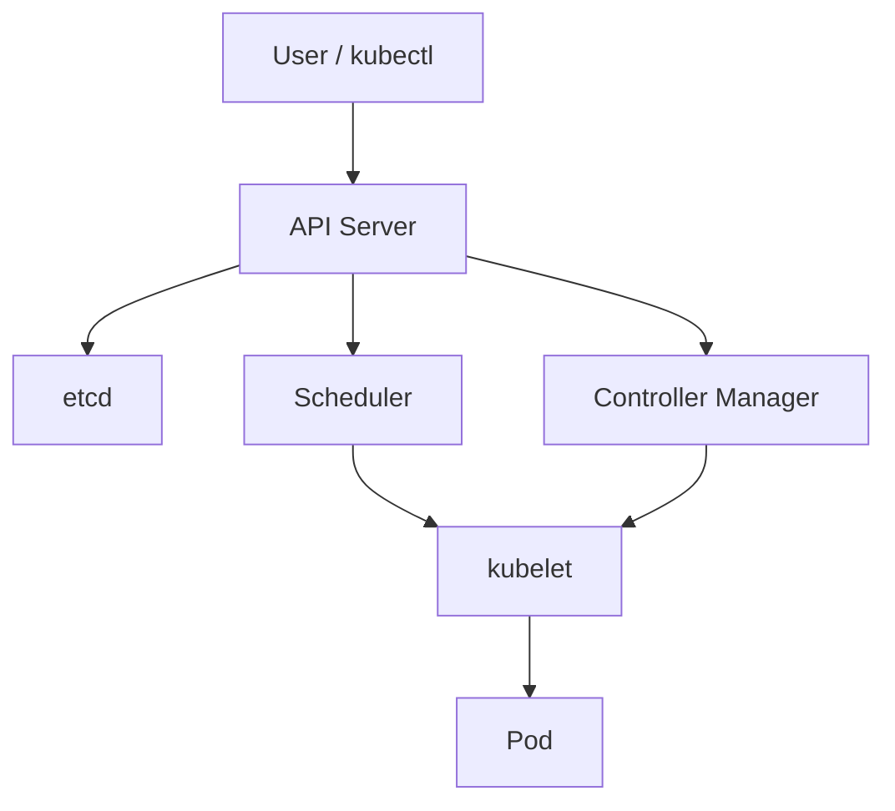

## ما هو كوبرنيتيس؟

كوبرنيتيس (Kubernetes) نظام لتجميع الحاويات وتنسيقها (Container Orchestrator).
يتكفل بجدولة (Scheduling) الحاويات على العقد (Nodes)، وإعادة تشغيلها عند الفشل،
وتوزيع الحمولة (Load Balancing).

## المعمارية بمخطط

## العناصر الأساسية

| المكوّن       | الدور                                              |
| ------------- | -------------------------------------------------- |
| `Pod`         | أصغر وحدة نشر، تحتوي حاوية أو أكثر                |
| `Deployment`  | يدير نسخ (Replicas) وتحديثات التطبيق               |
| `Service`     | عنوان ثابت للوصول إلى مجموعات البودات              |
| `Namespace`   | تقسيم منطقي للموارد داخل العنقود (Cluster)         |
