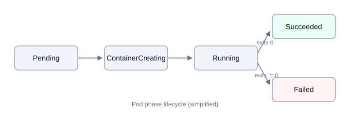
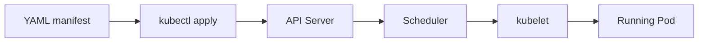

import Callout from '../../../src/components/Callout.astro';

## ما هو الـ Pod؟

الـ **Pod** هو أصغر وحدة نشر (Deployment Unit) في كوبرنيتيس. كل بود (Bod) يحتوي على
واحدة أو أكثر من الحاويات (Containers) تشترك في نفس عنوان الـ IP ونفس مساحة
التخزين (Volumes). عملياً لا ننشر حاوية منفرداً، بل ننشر Pod.

<Callout>
  لا تُنشئ بوداً (Pod) بشكل مباشر في الإنتاج؛ استخدم <code>Deployment</code> حتى
  يعيد كوبرنيتيس تشغيل البودات تلقائياً عند فشل العقدة.
</Callout>

## دورة حياة البود



## التحقق من البودات

```bash
kubectl get pods -A
kubectl describe pod my-app-7d9f8b
kubectl logs -f my-app-7d9f8b
```

## مثال على YAML

```yaml
apiVersion: v1
kind: Pod
metadata:
  name: nginx-pod
  labels:
    app: nginx
spec:
  containers:
    - name: nginx
      image: nginx:1.27-alpine
      ports:
        - containerPort: 80
      resources:
        requests:
          cpu: "100m"
          memory: "128Mi"
        limits:
          cpu: "500m"
          memory: "256Mi"
```

## تدفق الإنشاء



<Callout type="tip" title="تلميح">
  استخدم <code>kubectl apply --dry-run=client -f</code> للتحقق من صحة الملف قبل
  تطبيقه على عنقود الإنتاج.
</Callout>
