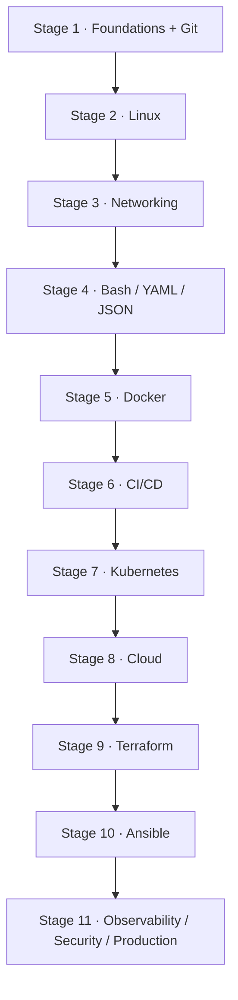
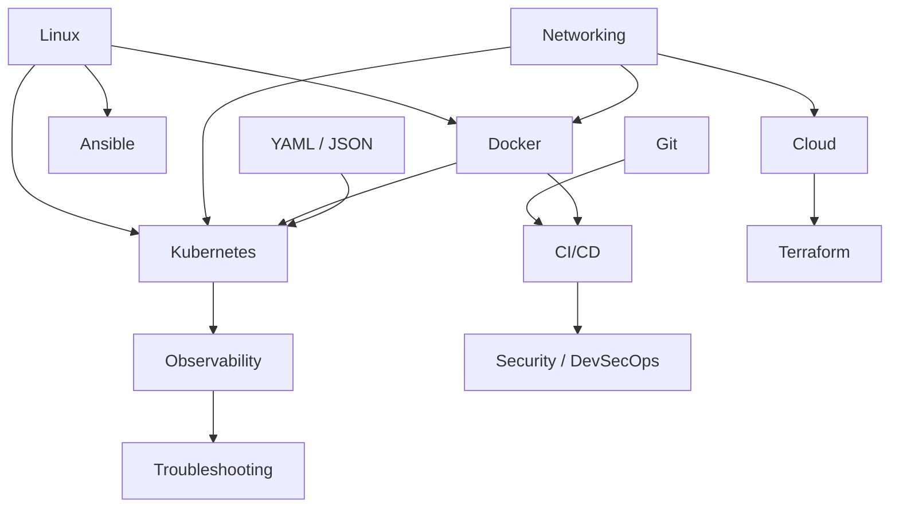

# Ops Handbook — Content Roadmap & Learning Architecture

> A **human-readable content blueprint**, not an application configuration and
> not a fixed roadmap. It answers: *what should exist in Ops Handbook, how it
> is organized, what to learn first, and what depends on what.* The folder
> structure in `content/` and the presentation registry in
> `src/data/categories.ts` may grow, merge, split or disappear at any time —
> this document sketches the current intent and is updated whenever that
> intent changes.
>
> **Planning only**: topic names, scope, dependencies and priorities — no
> educational content lives here. Nothing in this file is wired into the
> application.

## Documentation architecture

```text
Documentation Area → Technology / Tool → Article

content/<area>/<tool>/<article>.md        →  /docs/<area>/<tool>/<article>
content/<area>/<tool>/<article>/index.mdx →  /docs/<area>/<tool>/<article>
content/<area>/<concept>.md               →  /docs/<area>/<concept>
```

- **Area** — one of the 14 registered documentation areas below. Its id is
  the first folder level (`category` in frontmatter is derived from it and
  only overrides it explicitly).
- **Tool / technology** — the second folder level (`docker`, `kubernetes`,
  `linux` …). Each tool with at least one article automatically gets a tool
  landing page at `/docs/<area>/<tool>`. Tool names stay English in every
  locale.
- **Article** — the actual page. Articles written directly under an area (no
  tool level) are still supported and appear ungrouped on the area page.

---

## A. Documentation areas

Priority = **write order**, not importance: P0 = learning spine, write first;
P1 = professional core; P2 = production depth (still includes a small critical
Core tier).

| Area (category id) | Purpose | Core technologies | Priority |
| --- | --- | --- | --- |
| `devops-fundamentals` | Shared fundamentals everything else assumes | SDLC, CI/CD principles, environments, toolchain concepts | P0 |
| `operating-systems` | The OS most DevOps work happens on | Linux: shell, filesystem, permissions, processes, systemd | P0 |
| `networking` | How systems talk to each other | TCP/IP, DNS, HTTP/TLS, SSH, firewalls, load balancing | P0 |
| `version-control` | Source control workflow | Git (+ GitHub/GitLab collaboration flow) | P0 |
| `programming-scripting` | Scripting and data formats | Bash, Python, YAML/JSON, regex, HTTP APIs | P1 |
| `containers` | Container images and runtimes | Docker (+ containerd/Podman concepts) | P0 |
| `ci-cd-automation` | Automated delivery | GitHub Actions (+ GitLab CI, Jenkins) | P1 |
| `container-orchestration` | Container orchestration | Kubernetes (+ Helm) | P1 |
| `cloud-platforms` | Cloud platforms and services | AWS first (+ Azure/GCP concept-level) | P1 |
| `infrastructure-as-code` | Infrastructure as code | Terraform (+ OpenTofu) | P1 |
| `configuration-management` | Configuration automation | Ansible | P2 |
| `observability` | Knowing what production is doing | Prometheus, Grafana, log stack, OpenTelemetry concepts | P2 |
| `security-devsecops` | Keeping systems and pipelines safe | Secrets, IAM, scanning (Trivy), hardening | P2 |
| `troubleshooting-production` | Diagnosing and fixing real incidents | Method, playbooks, postmortems | P2 |

Every row is **indicative, not binding**: an area might stay empty for a long
time, a tool might never appear, or a row might be split into two. Folders
exist only as places to put files — nothing in the platform depends on a
folder existing.

Sizing intent: the **Core** tiers below total roughly 70–90 articles — a
realistic long-term target for a single maintainer. Recommended follows Core;
Advanced is written last or never.

---

## B. Learning stages

A suggested progression across the whole knowledge base. Arrows mean
*recommended order*, not a strict course: stages can overlap, and the site
stays documentation-first (no lessons, no progress tracking).

```text
Stage 1   Foundations + Git          — vocabulary, delivery lifecycle, source control
    ↓
Stage 2   Systems (Linux)            — the interface every tool runs through
    ↓
Stage 3   Networking core            — the transport everything uses
    ↓
Stage 4   Scripting & formats        — Bash/YAML/JSON glue (can start with Stage 2)
    ↓
Stage 5   Containers (Docker)        — the unit later stages operate on
    ↓
Stage 6   CI/CD                      — Git + containers → automate build/test/ship
    ↓
Stage 7   Orchestration (Kubernetes) — many containers, many hosts
    ↓
Stage 8   Cloud (AWS primitives)     — managed versions of what you already know
    ↓
Stage 9   Infrastructure as Code     — codify the cloud you just clicked through
    ↓
Stage 10  Configuration Management   — OS state on those servers
    ↓
Stage 11  Observability · Security · Production  (parallel capstone)
```

Why each stage sits where it does (concise):

1. **Foundations + Git** — every later article assumes this vocabulary and a
   place to keep change history.
2. **Linux** — all tooling is Linux processes, files, permissions and
   services; nothing is debuggable without it.
3. **Networking** — DNS/HTTP/TCP underpin containers, CI APIs, cloud, and
   most outages.
4. **Scripting & formats** — automation glue and every tool's config
   language; overlaps stages 2–3 (start early, deepen over time).
5. **Docker** — packages app + dependencies deterministically; needs Linux
   and basic networking.
6. **CI/CD** — with Git and containers in place, changes can be built, tested
   and shipped automatically — first professional-workflow payoff.
7. **Kubernetes** — assumes containers, networking and YAML; solves running
   many services on many hosts.
8. **Cloud** — managed equivalents of everything already met; networking
   knowledge transfers directly.
9. **Terraform** — manual cloud clicking taught the primitives; IaC now has
   something real to codify.
10. **Ansible** — needs Linux + SSH; complements IaC (OS state vs resource
    state).
11. **Observability · Security · Production** — there is finally something
    running to observe, secure and debug; the three are parallel endgame
    tracks, not a sequence.

---

## C. Technology scope

Topic names only — no explanations. **Core** = must exist · **Recommended** =
rounds out real work · **Advanced** = depth, optional.

### devops-fundamentals (concepts)

- **Core:** SDLC · CI/CD principles · Environments (dev/stage/prod) · IaC vs
  config management idea · Toolchain overview · DevOps culture in brief
- **Recommended:** Release strategies · SLO/SLI vocabulary · DORA metrics ·
  Technical debt
- **Advanced:** Platform engineering intro · Site reliability concepts

### Linux (`operating-systems`)

- **Core:** Shell basics · Filesystem & paths · Permissions & ownership ·
  Users & groups · Processes · Package management · Text processing
- **Recommended:** Services & systemd · Networking commands (ss, firewall-cmd,
  iptables basics) · Disks & mounts · Logs (journalctl) · Bash scripting
  basics
- **Advanced:** Kernel parameters · SELinux/AppArmor · Performance basics
  (top, iostat) · Cron & systemd timers

### Networking (concept area)

- **Core:** OSI & TCP/IP models · IP addressing & subnets · DNS · HTTP/HTTPS ·
  TLS basics · SSH
- **Recommended:** Load balancing · Firewalls & security groups · NAT &
  routing · Diagnostics (ping, dig, curl)
- **Advanced:** Packet analysis (tcpdump) · IPv6 · Service mesh concepts

### Git (`version-control`)

- **Core:** Commits & history · Staging · Branching · Merging & conflicts ·
  Remotes & pull request flow
- **Recommended:** Rebasing · Stashing · Tags & releases · Hooks ·
  Monorepo tips
- **Advanced:** Reflog & recovery · Submodules · Worktrees · Git internals

### Bash / Python (`programming-scripting`)

- **Core:** Bash syntax, pipes & substitution · Variables & conditions ·
  Loops · Exit codes & error handling · JSON & YAML · Regex
- **Recommended:** Python basics for automation · HTTP APIs (curl, REST) ·
  File parsing tasks
- **Advanced:** Python testing · Async/batch scripting · Performance &
  portability

### Docker (`containers`)

- **Core:** Images · Containers · Dockerfile · Volumes · Networks · CLI
  essentials
- **Recommended:** Compose · Registries & tagging · Multi-stage builds ·
  Logs & basic monitoring
- **Advanced:** Image scanning & hardening · Size/performance optimization ·
  containerd & Podman · Rootless & resource limits

### CI/CD (`ci-cd-automation`)

- **Core:** Pipeline concepts · GitHub Actions workflows · Build & test stages ·
  Secrets in CI · Artifacts
- **Recommended:** GitLab CI · Jenkins (orientation) · Deployment strategies
  (rolling, blue/green) · Branch protection & review flow
- **Advanced:** Self-hosted runners · Matrix builds · Release automation ·
  GitOps introduction

### Kubernetes (`container-orchestration`)

- **Core:** Cluster architecture · Pods · Deployments · Services · Namespaces ·
  Labels & selectors · kubectl basics
- **Recommended:** Ingress · ConfigMaps & Secrets · Storage (PV/PVC) ·
  StatefulSets · Helm basics
- **Advanced:** Network policies · RBAC · Autoscaling · Operators · Cluster
  troubleshooting

### AWS (`cloud-platforms`)

- **Core:** IAM · Compute (EC2) · Object storage (S3) · VPC & networking
  basics · Pricing model
- **Recommended:** Managed databases · Load balancers · DNS (Route 53) ·
  Serverless orientation · Availability & multi-AZ ideas
- **Advanced:** CDN · Advanced networking (endpoints, peering) ·
  Well-Architected review topics

### Terraform (`infrastructure-as-code`)

- **Core:** HCL basics · Providers · Resources · State · Plan/Apply workflow
- **Recommended:** Variables & outputs · Modules · Remote state & locking ·
  Import
- **Advanced:** Workspaces · Drift management · CI integration · Testing
  conventions

### Ansible (`configuration-management`)

- **Core:** Ad-hoc commands · Inventory · Playbooks · Modules · Idempotency
- **Recommended:** Roles · Variables & facts · Handlers
- **Advanced:** Ansible Vault · Dynamic inventory · AWX orientation

### Observability (concept area)

- **Core:** Metrics vs logs vs traces · Prometheus basics · Grafana
  dashboards · RED/USE · Alerting basics
- **Recommended:** Loki/ELK log stack · Structured logging · SLOs in practice ·
  OpenTelemetry concepts
- **Advanced:** Cardinality & cost · Tail sampling · On-call practices

### Security / DevSecOps (concept area)

- **Core:** Secrets management · Least privilege · Dependency & image
  scanning (Trivy) · Basic hardening
- **Recommended:** IAM deep dive · SAST/DAST orientation · Supply chain
  (SBOM, signing) · Container security
- **Advanced:** Policy as code · Zero trust orientation · Incident response

### Troubleshooting & Production (concept area)

- **Core:** Troubleshooting method · Reading logs · HTTP/status debugging ·
  Resource saturation (CPU, memory, disk)
- **Recommended:** Network diagnostics · Database failure modes · Performance
  baselines · Postmortems
- **Advanced:** Chaos/ fault injection · Capacity planning · Complex failure
  case studies

---

## D. Dependency map

Topic-level rule: a topic may have **several** prerequisites; dependencies are
guidance for reading order, never a locking mechanism.



Cross-technology prerequisites (focused graph — recommended reading edges, not
a DAG to enforce):



Examples of what the edges mean (multi-prerequisite node):

```text
Kubernetes
├── Linux
├── Networking
├── Containers (Docker)
└── YAML
```

---

## E. Project opportunities

Proposals only — projects are **not** articles and are not implemented here.
They reinforce a stage when the documentation for it exists.

| Stage | Project idea | Reinforces |
| --- | --- | --- |
| 5 | Containerize a sample app; run it with Compose | Docker core |
| 6 | GitHub Actions pipeline: build → test → publish image | CI/CD core |
| 7 | Deploy the Stage-5 app to a local cluster (kind/minikube) | Kubernetes core |
| 8 | Free-tier AWS footprint: VPC + compute + storage | Cloud core |
| 9 | Reprovision the Stage-8 footprint with Terraform | IaC core |
| 10 | Configure the Stage-8 servers with Ansible | Config management |
| 11 | Capstone: repo → CI → registry → cluster/VM → dashboards → alert | Observability + production |

Rule: **documentation first, project second** — a project section or article
only after its stage's Core topics exist.

---

## F. Future / optional topics

Deliberately outside the core roadmap (write only if real need appears):

- GitOps (Argo CD / Flux) · Service mesh (Istio / Linkerd) · Serverless depth
- Helm advanced · Python-for-DevOps depth · Cost optimization · Multi-cloud
  strategy · eBPF/network debugging · Platform engineering / internal
  developer portals · Chaos engineering · ChatOps · PowerShell/Windows ops

**Area candidates considered, not added** (see also report): data/databases
(backup, replication, migrations) and developer-experience/platform — for now
they fold into `cloud-platforms`, `troubleshooting-production` and
`devops-fundamentals`; revisit only if content volume justifies a 15th area.

---

## Boundaries & overlap

Where two areas could compete for the same topic — the canonical home wins;
the other side links via `tags` (one article, two audiences — never
duplicated).

| Overlap | Boundary |
| --- | --- |
| Networking vs Troubleshooting | Teaches how DNS/TLS/LB *work* → Networking. Symptom → diagnosis → fix playbook → Troubleshooting. |
| Observability vs Troubleshooting | Instrumenting and reading signals (Prometheus, logs, SLOs) → Observability. Using those signals to repair an incident → Troubleshooting. |
| Fundamentals vs CI/CD | Principles and vocabulary (what/why of delivery) → Fundamentals. Concrete tool workflows (how) → CI/CD. |
| Programming vs Operating Systems | Language/format skills (Bash as a language, YAML, regex) → Programming. Interactive shell and OS administration → Operating Systems. |
| Containers vs Orchestration | Single-host runtime (images, compose) → Containers. Multi-host scheduling, cluster objects → Orchestration. |
| Cloud vs IaC | The platform's primitives and services → Cloud. The method of provisioning them declaratively → IaC. |
| IaC vs Configuration Management | Creating/changing *resources* (servers exist) → IaC. State of software *on* those servers → Config Management. |
| Security vs CI/CD | How pipelines are built → CI/CD. Scanning, secrets and hardening inside them → Security / DevSecOps. |

Duplication rule: every topic gets exactly **one** canonical article in one
area; cross-cutting audiences are served by `tags` + the automatic *Related
topics* section.

---

## Production relevance (planning metadata)

For scope planning, important topics are tagged mentally as: **Conceptual** ·
**Practical** · **Production-oriented** · **Troubleshooting-oriented**
(a topic can be several). Rough orientation per scope:

- Conceptual-heavy: fundamentals, networking theory, cloud architecture.
- Practical-heavy: Docker, Git, CI/CD, Terraform, Ansible.
- Production-heavy: observability, security, cloud operations.
- Troubleshooting-heavy: troubleshooting area itself + Linux, network
  diagnostics, database failure modes.

This is **roadmap metadata only** — it is intentionally NOT a frontmatter
field (no schema change, no new UI).

---

## Content ordering: navigation vs learning

- Frontmatter `order:` = **navigation order** inside one group (a tool or an
  area's direct articles): intro → core → deeper, readable top to bottom.
  Keep it local — multiples like 10, 20, 30 leave room to insert later.
- **Learning dependency** lives in this document (stages + dependency map),
  not in frontmatter. Do not try to encode a global curriculum into per-group
  `order` fields; the site is a reference, and readers arrive at different
  points.
- If stage membership ever needs to be *visible*, express it as a `tags`
  entry (`stage-5`) or a presentation-side grouping — never as a new schema
  field or a course engine.

---

## How the structure evolves

- **Add an article**: copy `content/_template/article.mdx` to
  `content/<area>/<tool>/` (or drop a plain `topic.md` under `content/<area>/`).
  It appears in navigation, search, the area page and the tool landing page
  after the next build — no code changes. `category`/`tool` are derived from
  the folders, so frontmatter stays minimal.
- **Add a tool**: create `content/<area>/<newtool>/`. The tool landing page
  `/docs/<area>/<newtool>` is generated automatically from the collection the
  moment its first article exists. No registry, no route file, no config.
- **Add an area**: create `content/<area>/` and register it in
  `src/data/categories.ts` *to* give it a display name (English/technical),
  bilingual descriptions, an icon, and a visual position among the known
  areas.
- **Reorder material inside a group**: change frontmatter `order:` — never
  rename folders with numeric prefixes (`01-linux`). Folder names stay
  stable; ordering lives in metadata.
- **Split or merge areas**: move files, update their `category:` field only
  if the area id itself changes (it is normally derived), done. URLs change
  (old ones keep working via the redirects in `astro.config.mjs`).
- **Retire an area**: delete the folder (or set its pages `draft: true`).

## Learning paths are not folders

The same article can serve several audiences (e.g. a networking article useful
to both `container-orchestration` and `cloud-platforms` readers). Each page has
exactly **one** sidebar home (its area folder) but any number of **tags**.
Future curated learning paths (beginner track, exam prep, …) should be
assembled from tags and metadata — never by duplicating or relocating content.

```yaml
---
tags:
  - containers
  - kubernetes
  - networking
---
```

If explicit learning phases (beginner track, ordered module, exam prep) are
needed later, they should be **views over this metadata** — tag-curated lists
or an `order`+`level` grouping in presentation code — not a new content
schema, a course engine, or progress tracking. The reference-first architecture
stays as-is.

## Current limitations

- **Unregistered areas are second-class in presentation only**: they work
  fully (routing, sidebar, search) but display their raw English id as the
  label, sort after all registered areas, and are omitted from the
  `/docs` area index — until added to `src/data/categories.ts` (one entry).
- **Tool landing pages exist only where articles exist**: an area page lists
  exactly the tools that have at least one article. Tools reserved in the
  roadmap but without content are not shown — there is intentionally no
  separate tool registry to maintain.
- **Article paths are one level deeper than tool pages**: `/docs/<area>/<tool>`
  is the tool landing page, so an article sits at
  `/docs/<area>/<tool>/<article>`. A flat file `content/<area>/<tool>.md`
  would collide with the tool landing page and should not be used.
- **Category presentation lives in one file**: Arabic descriptions, icons and
  tool display names are defined in `src/data/categories.ts` alongside labels
  and order — adding or changing them never requires touching content.
- **Learning paths are implicit**: tags carry cross-cutting membership today;
  a first-class path view does not exist yet and should be built from tags
  when needed.
- **This roadmap is invisible to the site**: scope entries, stages and
  dependencies have no representation in the UI until their articles exist —
  by design (documentation-first).

## Related documents

- [`content/README.md`](content/README.md) — authoring guide (day-to-day)
- [`README.md`](README.md) — platform overview and architecture decisions
